# Data Science by IBM

- [Data Science by IBM](#data-science-by-ibm)
  - [What is Data Science -- Week 1](#what-is-data-science----week-1)
  - [What is Data Science -- Week 2](#what-is-data-science----week-2)
  - [What is Data Science -- Week 3](#what-is-data-science----week-3)
  - [Open Source tools for Data Science -- Week 1](#open-source-tools-for-data-science----week-1)
  - [Open Source tools for Data Science -- Week 2](#open-source-tools-for-data-science----week-2)
  - [Open Source tools for Data Science -- Week 3](#open-source-tools-for-data-science----week-3)
  - [Data Science Methodology -- Week 1](#data-science-methodology----week-1)
    - [From Problem to Approach](#from-problem-to-approach)
    - [From Requirements to Collection](#from-requirements-to-collection)
  - [Data Science Methodology -- Week 2](#data-science-methodology----week-2)
    - [From Understanding to Preparation](#from-understanding-to-preparation)
    - [From Modelling to Evaluation](#from-modelling-to-evaluation)
  - [Data Science Methodology -- Week 3](#data-science-methodology----week-3)
    - [From Deployment to Feedback](#from-deployment-to-feedback)
  - [Python for Data Science and AI -- Week 1](#python-for-data-science-and-ai----week-1)
  - [Python for Data Science and AI -- Week 2](#python-for-data-science-and-ai----week-2)
  - [Python for Data Science and AI -- Week 3](#python-for-data-science-and-ai----week-3)
  - [Python for Data Science and AI -- Week 4](#python-for-data-science-and-ai----week-4)
  - [Python for Data Science and AI -- Week 5](#python-for-data-science-and-ai----week-5)
  - [Databases and SQL for Data Science -- Week 1](#databases-and-sql-for-data-science----week-1)
  - [Databases and SQL for Data Science -- Week 2](#databases-and-sql-for-data-science----week-2)
  - [Databases and SQL for Data Science -- Week 3](#databases-and-sql-for-data-science----week-3)
  - [Databases and SQL for Data Science -- Week 4](#databases-and-sql-for-data-science----week-4)
  - [Data Analysis with Python -- Week 1](#data-analysis-with-python----week-1)
  - [Data Analysis with Python -- Week 2](#data-analysis-with-python----week-2)
  - [Data Analysis with Python -- Week 3](#data-analysis-with-python----week-3)
  - [Data Analysis with Python -- Week 4](#data-analysis-with-python----week-4)
  - [Data Analysis with Python -- Week 5](#data-analysis-with-python----week-5)
  - [Data Visualization with Python -- Week 1](#data-visualization-with-python----week-1)
  - [Data Visualization with Python -- Week 2](#data-visualization-with-python----week-2)
  - [Data Visualization with Python -- Week 3](#data-visualization-with-python----week-3)
  - [Machine Learning with Python -- Week 2](#machine-learning-with-python----week-2)
    - [Linear Regression](#linear-regression)
    - [Multiple Linear Regression](#multiple-linear-regression)
    - [Polynomial Regression](#polynomial-regression)
  - [Machine Learning with Python -- Week 3](#machine-learning-with-python----week-3)
    - [K-Nearest Neighbours](#k-nearest-neighbours)
    - [Decision Trees](#decision-trees)
    - [Logistic Regression](#logistic-regression)
    - [Support Vector Machine (SVM)](#support-vector-machine-svm)
  - [Machine Learning with Python -- Week 4](#machine-learning-with-python----week-4)
    - [K-Means](#k-means)
    - [Hierarchical Clustering](#hierarchical-clustering)
    - [Density-based Clustering](#density-based-clustering)
  - [Machine Learning with Python -- Week 5](#machine-learning-with-python----week-5)
    - [Content-based Recommender](#content-based-recommender)
    - [Collaborative Filtering](#collaborative-filtering)
  - [Applied Data Science Capstone -- Week 1](#applied-data-science-capstone----week-1)
  - [Applied Data Science Capstone -- Week 2](#applied-data-science-capstone----week-2)
  - [Applied Data Science Capstone -- Week 3](#applied-data-science-capstone----week-3)


## What is Data Science -- Week 1

Data Science is the field of exploring, manipulating, and analyzing data, and using data to answer questions or make recommendations.

As Data Science is not a discipline traditionally taught at universities, contemporary data scientists come from diverse backgrounds such as engineering, statistics, and physics.

*Quiz* 010101

1. Harvard Business Review called Data Science the sexiest job in the 21st century. -- **True**
2. According to the report by the McKinsey Global Institute, by 2018, it is projected that there will be a shortage of 140,000 - 190,000 people with deep analytical skills in the world. -- **False (in US alone)**
3. Walmart addressed its analytical needs by approaching Kaggle to host a competition for analyzing its proprietary data. -- **True**
4. What is the average base salary for a data scientist reported by the New York Times? -- **$112,000**
5. According to professor Haider, the three important qualities to possess in order to succeed as a data scientist are curious, judgemental, and proficient in programming. -- **False (argumentative as the last one)**

Using complicated machine learning algorithms does not always guarantee achieving a better performance. Occasionally, a simple algorithm such as k-nearest neighbor can yield a satisfactory performance comparable to the one achieved using a complicated algorithm. It all depends on the data.

The cloud allows you to bypass the physical limitations of your personal computer and the systems you are using. One limitation of the cloud is that you are not able to deploy capabilities of advanced machines that do not necessarily have to be your machines.

*Quiz* 010102

1. Hal Varian, the chief economist at Google, declared that "the sexy job in the next ten years will be **statisticians**, but it is widely believed that what he really meant were **data scientists**.
2. The author defines a data scientist as someone who finds solutions to problems by analyzing data using appropriate tool and then tells stories to communicate their finding to the relevant stakeholders. -- **True**
3. According to the reading, the author defines data science as the art of uncovering the hidden secrets in data. -- **False**
4. What is admirable about Dr. Patil's definition of a data scientist is that it limits data science to activities involving machine learning. -- **False (that it is inclusive of individuals of various academic backgrounds and training and does not restrict the definition of a data scientist to a particular tool or subject it to a certain arbitrary minimum threshold of data size)**
5. According to the reading, the characteristics exhibited by the best data scientists are those who are curious, ask good questions, and have at least 10 years of experience. -- **False**


## What is Data Science -- Week 2

Data science and business analytics became very hot subjects recently, since around the year 2012.

Big data was started by Google when Google tried to figure out how to solve their PageRank algorithm.

Big data is data that is large enough and has enough volume and velocity that you cannot handle it with traditional database systems.

According to Dr. White, most of the components of data science, such as probability, statistics, linear algebra, and programming, have been around for many decades but now we have the computational capabilities to apply combine them and come up with new techniques and learning algorithms.

*Quiz* 010201

1. According to the reading, the output of a data mining exercise largely depends on the skills of the data scientist carrying out the exercise. -- **False**
2. When data are missing in a systematic way, you can simply extrapolate the data or impute the missing data by filling in the average of the values around the missing data. -- **False (when data are missing in a systematic way, you should determine the impact of missing data on the results and whether missing data can be excluded from the analysis)**
3. Prior Variable Analysis and Principal Component Analysis are both examples of a data reduction algorithm. -- **False (Prior Variable Analysis is not a data reduction algorithm)**
4. After the data are appropriately processed, transformed, and stored, machine learning and non-parametric methods are a good starting point for data mining. -- **False**
5. In-sample forecast is the process of formally evaluating the predictive capabilities of the models developed using observed data to see how effective the algorithms are in reproducing data. -- **True** 

Neural networks have been around for decades, but people decided not to develop them any more because they were computationally very expensive.

The use cases for deep learning include speech recognition and classifying image at a large scale.

According to Dr. White, if someone is coming into a data science team, the first skills they would need are: knowing basic probability and some basic statistics, knowing some algebra and some calculus, understanding relational databases, knowing how to program, at least have some computational thinking.

According to Dr. White, the industrial world is shifting to a new trend, and for high school students to be on the right side of this new trend, his advice to them is: 
* take a course in probability
* learn how to program
* learn some math
* try to start experimenting with building small systems that work and are useful
* learn statistics

Netflix uses machine learning to recommend movies to you based on movies you have already watched and liked or disliked.

*Quiz* 010202

1. The real added value of the author's research on residential real estate is quantifying the magnitude of relationships between housing prices and different determinants. -- **True**
2. Regression is a statistical technique developed by Sir Frances Galton. -- **True**
3. According to the reading, the author discovered that an additional bedroom adds more to the housing prices than an additional washroom. -- **False (other way round)**
4. The author discovered that, all else being equal, houses located less than 5km but more than 2km to shopping centres sold for more than the rest. -- **True**
5. "What are typical land taxes in a house sale?" is a question that can be put to regression analysis. -- **False**


## What is Data Science -- Week 3

What are some of the first steps that companies need to take to get started in data science? 
* Start collecting data
* Put together a team of data scientists

Curiosity is one of the most important skills that a data scientist should have in addition to sense of humor and story telling.

When hiring a data scientist, you need to ensure that the candidate is passionate about your field of work. A brilliant data scientist who is passionate about the field of IT won't necessary excel in the field of healthcare if they are passionate about it.

Which of the following are applications of data science?
* Augmented Reality
* Optimizing resource allocation for relief aid
* Determining if an application for a credit card should be accepted based on the applicant's financial history and data

*Quiz* 010301

1. According to the reading, what is the ultimate purpose of analytics? -- **To communicate findings to stakeholders to formulate policy or strategy**
2. The reading mentions a common role of a data scientist is to use analytics insights to build a narrative to communicate findings to stakeholders. -- **True**
3. The United States Economic Forecast is a publication by -- **Deloitte University Press**
4. The report discussed in the reading successfully did the job of -- **using data and analytics to generate likely economic scenarios**
5. According to the reading, it is recommended that a team waits until the results of analytics are out before they can decide on the final deliverable. -- **False (in order to produce a compelling narrative, initial planning and conceptualizing of the final deliverable is of extreme importance)**

*Quiz* 010302

1. Regardless of the length of the final deliverable, the author recommends that it includes a cover page, table of contents, executive summary, detailed contents, acknowledgements and references. -- **True**
2. An introductory section is always helpful in -- **setting up the problem for the read who might be new to the topic**
3. The result section is where you present -- **your empirical findings**
4. The discussion section is where you -- **craft your main arguments by building on the results; rely on the power of narrative to enable numbers to communicate your thesis to your readers; highlight how your findings provide the ultimate missing piece to the puzzle**
5. Adding a list of references and an acknowledgement section are examples of housekeeping, according to the author. -- **True**


## Open Source tools for Data Science -- Week 1

Skill Network Labs is an environment that contains tools such as RStudio, Jupyter Network, and Zeppelin Notebook. These tools provide an interactive environment for you to perform data analysis, data visualization, machine learning and image recognition. 

*Quiz* 

1. What is Skills Network Labs? -- **an environment that saves time: from installing, configuring and maintaining tools; a web-based environment that data science practitioners and enthusiasts alike can use for free; an online virtual lab environment that includes several open data science tools in the clouds**
2. Skills Network Labs provides an integrated environment to -- **learn and try various, popular data science tools; use tools such as Python and Scala; use tools such as R and Spark; save your time without needing to install and configure these tools**
3. Zeppelin and Jupyter Notebooks are great for -- **interactive data analytics**
4. Which of the following feature of RStudio specifically enables you to create interactive apps or visualizations? -- **script editor**
5. Basic charts are already included in Apache Zeppelin, allowing you to convert data tables directly into visualizations without any code. -- **True**

Jupyter Notebooks are "interactive" documents that enable you to write and execute code in chunks (as opposed to all-or-none), add explanatory text, write mathematical equations. They are popular in data science as you can do most of the data science work (importing data, cleaning data, analyzing data, visualizing data, machine learning) and you can also share the notebooks to collaborate with others.

Jupyter Notebook refers the actual file while JupyterLab is the environment that organizes my various Jupyter Notebooks that allows me to run them.

To write and execute code in Jupyter Notebooks, first you need to write code in one of the gray code cells, and then press the Play button to execute the code. Alternatives to pressing the Play button include keyboard shortcuts such as Shift+Enter and Ctrl+Enter to run the code.

*Quiz* 

1. What can you write in Jupyter Notebooks? -- **code to be executed in one of the kernels (e.g. Python / R / Scala); stylized text in a format called "Markdown"; HTML code that can be written and rendered via Markdown cells**
2. What were Jupyter Notebooks called before the name was changed to Jupyter? -- **IPython notebooks**
3. If you wrote "# Hi there" in Markdown, this would be the equivalent of writing \<h1>Hi there\<\h1> in HTML. -- **True**
4. Which of the following options are TRUE? -- **download and save Jupyter Notebooks as .ipynb files; change kernels within a Jupyter Notebook; connect to databases from within Jupyter Notebooks**
5. Although you can change the kernel of the Jupyter Notebook between different programming languages (e.g. Python / R / Scala), you cannot use multiple kernels within the same Jupyter notebook (e.g. running Python, R and Scala within the same notebook). -- **True**


## Open Source tools for Data Science -- Week 2

Zeppelin notebooks come with the following built in: Apache Spark, certain data visualizations and pivot charts.

You can use multiple programming languages in the same Zeppelin notebook. Note that Scala language and SQL language are used in different cells, but were operating one the same data. This is the key difference between Jupyter and Zeppelin notebooks; in Jupyter notebooks, you can only use one language at a time.

What is the filetype for Zeppelin notebooks? .json

*Quiz*

1. Apache Zeppelin lets you -- **document your code; display your output; show your visualizations within the Zeppelin netbook; switch between multiple languages**
2. Which is NOT an interpreter supported by Zeppelin? -- **Matlab**
3. Major benefits to using Zeppelin over Jupyter notebooks include -- **some visualizations are automatically generated in Zeppelin, thus minimizing code required; you can use multiple languages in the same notebook in Zeppelin, but not in Jupyter**
4. You cannot customize the width of your cells in a Zeppelin notebook. -- **False**
5. You can use multiple programming languages within the same Zeppelin notebook, and they can even operate on the same data. -- **True**

RStudio IDE is a tool for programming in R (only R).

You can upload files directly into RStudio IDE from your computer.

Generally speaking, why you should use the text editor to write code, rather than in the console? Using a text editor will provide you a larger space for you to write your code that you can save and even describe what your code does.

In R, what are datasets in tabular format typically called? Dataframes.

*Quiz*

1. RStudio IDE allows you to -- **analyze data; see your console; visualize your plots and graphs**
2. The reason why 'sc' is one of the default variables in RStudio IDE on Skills Network Labs is because -- **'sc' stands for "SparkContext" and is created by default to enable users to use Apache Spark from RStudio IDE**
3. What are ways that you can execute R code in RStudio? -- **from the script editor & console**
4. You can view a history of code you have previously executed on RStudio IDE. -- **True**
5. Which of the following options are True? -- you can use built-in datasets (dataframes) in RStudio, such as "mtcars".


## Open Source tools for Data Science -- Week 3

Jupyter Notebooks and RStudio are both available on IDM Data Science Experience.

In order to create a Project, you must first point to two resources: a storage type and a Spark service.

In Markdown, to ensure two lines of text are rendered as two separate lines of text, what should you do? Add at least two empty spaces at the end of the first line.

*Quiz*

1. What is the key difference between Skills Network Labs and IBM Watson Studio (Data Science Experience)? -- **IBM Watson Studio is an enterprise-ready environment with scalability in mind, whereas Skills network Labs is primarily a learning environment**
2. The only way to add notebooks to your project on IBM Watson Studio is to either create an empty notebook, or upload a notebook from your computer. -- **False**
3. Which of the following options are correct? -- **you can add collaborators to projects; collaborators on a project can add comments to notebooks; you can use Python 3, R or Scala with Jupyter Notebooks on Watson Studio**
4. In the upper right-hand corner of a Jupyter Notebook is the kernel interpreter (e.g. Python 3). Next to it is a circle. What does it mean if the circle is full, black circle and what should you do? -- **A black circle means that the kernel is not ready to execute more code. You can either wait, interrupt, or try to restart the kernel**
5. RStudio is available on IBM Watson Studio. -- **True**


## Data Science Methodology -- Week 1

In data mining, the Cross Industry Process for Data Mining (CRISP-DM) methodology is widely used. The CRISP-DM methodology is a process aimed at increasing the use of data mining over a wide variety of business applications industries. The intent is to take case specific scenarios and general behaviors to make them domain neutral. CRISP-DM is comprised of six steps with an entity that has to implement in order to have a reasonable chance of success.

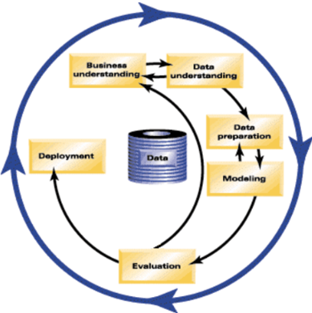

1. Business Understanding
2. Data Understanding
3. Data Preparation
4. Modelling
5. Evaluation
6. Deployment

### From Problem to Approach

Data science methodology begins with spending the time to seek clarification, to attain what can be referred to as a *business understanding*. (**1st in methodology**)

Establishing a clearly defined question starts with understanding the goal of the person asking the question.

Once the problem to be addressed is defined, the appropriate *analytic approach* for the problem is selected in the context of the business requirements. (**2nd in methodology**)

* If the question is to determine probabilities of an action -- use a predictive model
* If the question is to show relationships -- use a descriptive model
* If the question requires a yes/no answer -- use a classification model

Although the analytics approach is the second stage of the data science methodology, it is still independent of the business understanding stage. -- False (it is only when the problem to be addressed is defined, that the appropriate analytic approach for the problem can e selected in context of the business requirements)

*Quiz*

1. A methodology is an application for a computer program. -- **False**
2. The first stage of the data science methodology is Data Understanding. -- **False**
3. Business Understanding is an important stage in the data science methodology. Why? -- **Because it clearly defines the problem and the needs from a business perspective**
4. Which of the following statements about the analytic approach are correct? -- **if the question defined in the business understanding stage can be answered by determining probabilities of an action, then a predictive model would the right analytic approach; if the question defined in the business understanding deals with exploring relationships between different factors, then a descriptive approach, where clusters of similar activities based on events and preferences are examined, would be the right analytic method**
5. For the case study, a decision tree classification model was used to identify the combination of conditions leading to each patient's outcome. -- **True**

### From Requirements to Collection

Prior to undertaking the data collection and data preparation stages of the methodology, it is vital to define the *data requirements*, including identifying the necessary data content, formats and sources for initial data collection. (**3nd in methodology**)

Congestive heart failure patients with other significant medical conditions were included in the study in order to increase the sample size of the patients included in the study. -- False (congestive heart failure patients with other significant medical conditions were actually excluded from the study)

In this phase, the data requirements are revised and decisions are made as to whether or not the collection requires more or less data. Once the data ingredients are collected, then in the *data collection* stage, the data scientist will have a good understanding of what they will be working with. (**4th in methodology**)

When collecting data, it is alright to defer decisions about unavailable data, and attempt to acquire it at a later stage.

*Quiz*

1. Which of the following analogies is used in the videos to explain the Data Requirements and Data Collection stages of the data science methodology? -- **you can think of the Data Requirements and Data Collection stages as a cooking task, where the problem at hand is a recipe, and the data to answer the question is the ingredients**
2. The Data Requirements stage of the data science methodology involves identifying the necessary data content, formats and sources for initial data collection. -- **True**
3. Database Administrators determine how to collect and prepare the data. -- **False**
4. In the Data Collection stage, the business understanding of the problem is revised and decisions are made as to whether or not more data is needed. -- **False (not business understanding is revised but data requirements)**
5. Techniques such as supervised methods and unsupervised methods can be applied to the dataset, to assess the content, quality, and initial insights about the data. -- **False**


## Data Science Methodology -- Week 2

### From Understanding to Preparation

*Data Understanding* encompasses all activities related to constructing the dataset. Essentially, the *data understanding* section of the data science methodology answers the question: Is the data that you collected representative of the problem to be solved? (**5th in methodology**)

Transforming data in the *data preparation* phase is the process of getting the data into a state where it may be easier to work with. Specifically, the data preparation stage of the methodology answers the question: What are the ways in which data is prepared? (**6th in methodology**) 

To work effectively with the data, it must be prepared in a way that addresses missing or invalid values and removes duplicates, towards ensuring that everything is properly formatted.

The Data Preparation stage is the least time-consuming phase of a data science project, typically taking between 5 to 10 percent of the overall project time. -- False (most, 70 to 90 percent)

In the case study, the target variable was congestive heart failure (CHF) with 45 days following discharge from CHF hospitalization. -- False (45)

*Quiz*

1. The Data Understanding stage refers to the stage of removing redundant data. -- **False**
2. In the case study, during the Data Understanding stage, data scientists discovered that not all the congestive heart failure admissions that were expected were being captured. What action did they take to resolve the issue? -- **the data scientists looped back to the Data Collection stage, adding secondary and tertiary diagnoses, and building a more comprehensive definition of congestive heart failure admission**
3. The Data Preparation stage involves correcting invalid values and addressing outliers. -- **True**
4. Selecting the correct statement about what data scientists do during the Data Preparation stage. -- **data scientists define the variables to be used in the model; data scientists determine the timing of events; data scientists aggregate the data and merge them from different sources; data scientists identify missing data**
5. The Data Preparation stage is a very iterative and complicated stage that cannot be accelerated through automation. -- **False**

### From Modelling to Evaluation

*Data Modelling* focuses on developing models that are either descriptive or predictive. (**7th in methodology**)

1. Understand the question at hand
2. Select an analytic approach or method to solve the problem
3. Obtain, understand, prepare, and model the data

A training set is used to build a predictive model.

In the case study, the best performing model was the second model, with a relative cost of 4:1 and an overall accuracy of 85%. -- False (third one, 4:1, and 81%)

*Model Evaluation* is performed during model development and before the model is deployed. Evaluation allows the quality of the model to be assessed but it's also an opportunity to see if it meets the initial request. (**8th in methodology**)

The ROC curve is a useful diagnostic tool in determining the optimal classification model. This curve quantifies how well a binary classification model performs, declassifying the yes and no outcomes when some discrimination criterion is varied.

Model evaluation can have two main phases: a diagnostic measure phase and statistical significance testing.

*Quiz*

1. Select the correction statement. -- **a training set is used for predictive modelling**
2. A statistician calls a false-negative, a type I error, and a false-positive, a type II error. -- **False** (false-negative == type II; false-positive == type II)
3. The Modelling stage is followed by the Analytic Approach stage. -- **False**
4. Model Evaluation includes ensuring that the data are properly handled and interpreted. -- **True**
5. The ROC curve is a useful diagnostic tool for determining the optimal classification model. -- **True**


## Data Science Methodology -- Week 3

### From Deployment to Feedback

Once the model is evaluated and the data scientist is confident it will work, it is *deployed* and put to the ultimate test. Depending on the purpose of the model, it may be rolled out to a limited group of users or in a test environment, to build up confidence in applying the outcome for use across the board. (**9th in methodology**)

Once in play, *feedback* from the users will help to refine the model and assess it for performance and impact. The value of the model will be dependent on successfully incorporating *feedback* and making adjustments for as long sa the solution is required. (**10th in methodology**) 

The data science methodology is highly iterative, ensuring the refinement at each stage in the game.

Thinking like a data scientist:
1. forming a concrete business or research problem
2. collecting and analyzing data
3. building a model
4. understanding the feedback after model deployment

Learning how to work with data:
1. determining the data requirements
2. collecting the appropriate data
3. understanding the data
4. preparing the data for modelling

Learning how to derive the answer:
1. evaluating and deploying the model
2. getting feedback on it
3. using that feedback constructively so as to improve the model

*Quiz*

1. The final stages of the data science methodology are an iterative cycle between which of the different stages? -- **modelling, evaluation, deployment and feedback**
2. Feedback is not required once the model is deployed because the Model Evaluation stage would have assessed the model and made sure that it performed well. -- **False**
3. What does deploying a model into production represent? -- **it represents the beginning of an iterative process that includes feedback, model refinement and redeployment and requires the input of additional groups, such as marketing personnel and business owners**
4. The data science methodology is a specific strategy that guides processes and activities relating to data science only for text analytics. -- **False**
5. A data scientist determines that building a recommender system is the solution for a particular business problem at hand. What stage of the data science methodology does this represent? -- **analytic approach**
6. A car company asked a data scientist to determine what type of customers are more likely to purchase their vehicles. However, the data comes from several sources and is in a relatively raw format. What kind of processing can the data scientist perform on the data to prepare it for Modelling stage? -- **feature engineering; transforming the data into more useful variables; combining the data from the various sources; addressing missing invalid values**
7. What do data scientists typically use for exploratory analysis of data and to get acquainted with it? -- **they use descriptive statistics and data visualization techniques**
8. Which of the following represent the two important characteristics of the data science methodology? -- **it is a highly iterative process and it never ends**
9. For predictive models, a test set, which is similar to - but independent of - the training set, is used to determine how well the model predicts outcomes. This is an example of what step in the methodology? -- **model evaluation**
10. Data scientists should maintain continuous communication with stakeholders throughout a project so that business stakeholders can ensure the work remains on track to generate the intended solution. -- **True**

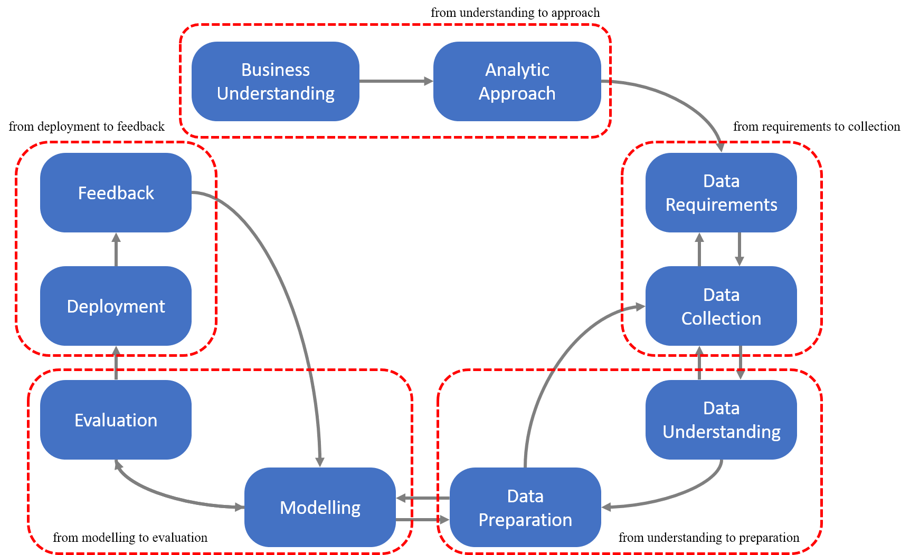


## Python for Data Science and AI -- Week 1

This Python course consists of the following modules: Python basics, Python data structures, Python programming fundamentals, working with Data in Python, final project.

*Quiz*

1. What is the type of the following: 1.0? -- **float**
2. What is the type of the following: "7.1"? -- **string**
3. What is the result of the following code segment: int(12.3)? -- **12**
4. What is the result of the following code segment: int(True)? -- **1**

*Quiz*

1. What is the result of the following code segment: 1/2? -- **0.5**
2. What is the value of x after the following lines of code? x=2; x=x+2 -- **4**
3. What is the result of the following operation 3+2*2? -- **7**
4. In Python3, what is the type of the variable x after the following: x=2/2? -- **float**

*Quiz*

1. In Python, if you executed name = 'Lizz', what would be the output of print(name[0:2])? -- **Li**
2. Consider the string A = '1934567', what is the result of the following operation A[1::2]? -- **'946'**
3. In Python, what is the result of the following operation: '1'+'2'? -- **'12'**
4. Given myvar = 'hello', how would you return myvar as uppercase? -- **myvar.upper()**
5. Consider the string Name = 'Michael Jackson', what is the result of the following operation Name.find('el')? -- **5**
6. What is the result of the following: str(1)+str(1)? -- **'11'**
7. What is the result of the following: "123".replace("12", "ab")? -- **"ab3"**


## Python for Data Science and AI -- Week 2

*Quiz*

1. What is the syntax to obtain the first element of the tuple: A=('a','b','c')? -- **A[0]**
2. Consider the tuple A=((11,12),[21,22]), that contains a tuple and list. What is the result of the following operation A[1]: -- **[21,22]**
3. Consider the tuple A=((11,12),[21,22]), that contains a tuple and list. What is the result of the following operation A[0][1]: -- **12**
4. What is the result of the following operation: '1,2,3,4'.split(',') -- **['1','2','3','4']**
5. After applying the following method, L.append(['a','b']), the following list will be only one element longer. -- **True**
6. Lists are mutable. -- **True**
7. Consider the following list: A=['hard rock',10,1.2]. What will list A contain after the following command is run: del(A[0])? -- **[10,1.2]**
8. If A is a list what does the following syntax do: B=A[:]? -- **variable B references a new copy or clone of the original list A**
9. What is the result of the following: len(('disco', 10))? -- **2**

*Quiz*

1. Consider the following dictionary: {"The Bodyguard": "1992", "Saturday Night Fever": "1977"}, select the keys: -- **"The Bodyguard" & "Saturday Night Fever"**
2. The variable release_year_dict is a Python dictionary, what is the result of applying the following method: release_year_dict.values() -- **retrieves the values of the dictionary**
3. How many identical keys can a dictionary have? -- **0**

*Quiz*

1. How do you cast the list A to the set a? -- **a = set(A)**
2. Consider the Set: V={'1','2'}, what is the result of V.add('3')? -- **{'1','2','3'}**
3. What is the result of the following: '1' in {'1','2'}? -- **True**


## Python for Data Science and AI -- Week 3

*Quiz*

1. What value of x will produce the output: "Hello\nMike"? -- **x="A"**
2. What is the output of the following code? -- **"Go Mike"**
3. What is the result of the following lines of code? -- **True**

*Quiz*

1. What is the output of the following few lines of code? -- **2/4/6**
2. What is the output of the following few lines of code? -- **5/4/3**
3. What is the output of the following few lines of code? -- **1 A / 2 B / 3 C**
4. What is the output of the following? -- **2**

*Quiz*

1. Consider the function delta, when will the function return a value of 1? -- **when the input is 0**
2. Given the function add shown below, what does the following return? -- **'11'**
3. What is the correct way to sort list 'B' using a method, the result should not return a new list, just change the list 'B'? -- **B.sort()**
4. What is the output of the following lines of code? -- **2**

*Quiz*

1. Consider the class Rectangle, what are the data attributes? -- self.height, self.width, self.color
2. What is the result of running the following lines of code? -- x=A y=B
3. What is the result of running the following lines of code? -- x=A y=2


## Python for Data Science and AI -- Week 4

*Quiz*

1. Consider the following text file. What is the output of the following lines of code? -- **This is line 1**
2. Consider the file object: File1. How would you read the first line of text? -- **File1.readline()**
3. What do the following lines of code do? -- **read the file "Example1.txt"**

*Quiz*

1. Consider the following line of code. What mode is the file object in? -- **write**
2. What do the following lines of code do? -- **append to the file "Example.txt"**
3. What task do the following lines of code perform? -- **copy the text from Example2.txt to Example3.txt**

**Using loc, iloc and ix**

*loc* is primarily label based. When two arguments are used, you use column headers and row indexes to select the data you want. *loc* can also take an integer as a row or column number. *loc* will return a *KeyError* if the requested items are not found.

*iloc* is integer-based. You use column numbers and row numbers to get rows or columns at particular positions in the data frame. *iloc* will return a *KeyError* if the requested indexer is out-of-bounds.

*ix* looks for a label. If *ix* does not find a label, it will use an integer. This means you can select data by using either column numbers and row numbers or column headers and row names using *ix*. (deprecated after pd 0.20.0)

*Quiz*

1. What is the result of applying the following method df.head() to dataframe df? -- **print the first 5 rows of the dataframe**
2. Consider the dataframe df, how would you access the element in the 1st row 3rd column? -- **df.ix[0,2]**
3. In the lab, you learned you can also obtain a series from a dataframe df. Select the correct way to assign the column with header Length to a pandas series to the variable x. -- **x = df['Length']**

*Quiz*

1. What is the result of the following lines of code? -- **array([0,0,0,0,0])**
2. What is the result of the following lines of code? -- **0**
3. What is the result of the following lines of code? -- **array([11,11,11,11,11])**

*Quiz*

1. How do you perform matrix multiplication on the numpy arrays A and B? -- **np.dot(A,B)**
2. What values does the variable out take if the following lines of code are run? -- **array([0,1])**
3. What is the value of Z after the following code is run? -- **array([[2,2],[2,2]])**

An API lets two pieces of software talk to each other. Pandas, an example of API, is actually a set of software components much of which are not even written in Python.


## Python for Data Science and AI -- Week 5

Extracting essential data from a dataset and displaying it is a necessary part of data science; therefore, individuals can make correct decisions based on data.


## Databases and SQL for Data Science -- Week 1

SQL is powerful language that is used for communicating with databases. Here are some of the advantages of learning SQL for someone interested in data science:
1. SQL will boost your professional profile as a data scientist
2. Learning SQL will give you a good understanding of relational databases
3. If you work with reporting tools that generate SQL queries for you, it might be useful to write your own SQL statements 

**What is SQL**

SQL (Structured Query Language) is a language used for relational databases and for querying data.

**What is data**

Data is a collection of facts in the form of words, numbers or even pictures. Data is one of the most critical assets of any business. Data is important, so it needs to be secure and it needs to be stored and accessed quickly.

**What is a database**

A database is repository of data. It is a program that stores data. A database also provides the functionality of adding, modifying and querying that data. Different kinds of databases store data in different forms. Data stored in tabular form is a **relational database**.

Which of the following statements are correct about databases?
* A database is a repository or logically coherent collection of data with some inherent meaning.
* Typically comes with functionality for adding, modifying and querying data.
* SQL or Structured Query Language is commonly used for accessing data in relational databases.

**What is an RDBMS**

RDBMS, or Relational DataBase Management System, is a set of software tools that controls the data: access, organization and storage. 

A relational database stores data in a tabular format - i.e. in rows and columns. But not all types of databases use the tabular format.

A Cloud Database is a database service built and accessed through a cloud platform. Benefits are: ease of use / scalability / disaster recovery. Database services are logical abstractions for managing workloads in a database. An instance of the Cloud Database operates as a service that handles all applications requests to work with the data in any of the databases managed by that instance.

*Quiz*

1. Which of the following statements are correct about databases? -- **a database is repository of data; there are different types of databases - Relational, Hierarchical, No SQL, etc; a database can be populated with data and be queried**
2. Which of the following statements about a Database is/are correct? -- **a database is a logically coherent collection of data with some inherent meaning**
3. Select the correct statement below about database services or database instances: -- **database services are logical abstractions for managing workloads in a database; an instance of the Cloud database operates as a service that handles all application requests to work with the data in any of the databases managed by that instance; the database service instance is the target of the connection requests from applications**
4. The 5 basic SQL commands are: -- **CREATE, SELECT, INSERT, UPDATE, DELETE**
5. A database stores data in tabular form only. -- **False**

There are 5 simple statements:
* create table
* insert data
* select data
* update data
* delete data

DDL (Data Definition Language) statements: define / change / drop data

DML (Data Manipulation Language) statements: read / modify data

The Primary Key in a relational table prevents duplicate rows in that table. -- True (the primary key of a relational table uniquely identifies each row in a table)

```
CREATE TABLE author
    (author_id CHAR(2) CONSTRAINT AUTHOR_PK PRIMARY KEY (author_id) NOT NULL,
    lastname VARCHAR(15) NOT NULL,
    firstname VARCHAR(15) NOT NULL,
    email VARCHAR(40),
    city VARCHAR(15),
    country CHAR(2)
    );
DROP TABLE author;
```

The main purpose of a database management system is not just to store the data but also facilitate retrieval of the data. The SELECT statement is called a query and the output we get from executing this query is called a result set or a result table.

You can retrieve just the columns you want. The order of the columns displayed always matches the order in the SELECT statement. WHERE clause helps to restrict the result set, which always requires a Predicate: True, False or Unknown. (not equal to <>)

```
SELECT ID,NAME FROM COUNTRY;
SELECT * FROM COUNTRY;
SELECT * FROM COUNTRY WHERE CCODE='CA';
```

COUNT() is a built-in function that retrieves the number of rows matching the query criteria. 

```
SELECT COUNT(COUNTRY) FROM MEDALS WHERE COUNTRY='CANADA';
```

DISTINCT is used to remove duplicate values from a result set.

```
SELECT DISTINCT COUNTRY FROM MEDALS WHERE MEDALTYPE='GOLD';
```

LIMIT is used for restricting the number of rows retrieved from the database.

```
SELECT * FROM MEDALS WHERE YEAR=2018 LIMIT 5
```

INSERT statement is used to populate the table with data. A single INSERT statement can be used to insert one or multiple rows in a table.

```
INSERT INTO AUTHOR
    (AUTHOR_ID, LASTNAME, FIRSTNAME, EMAIL, CITY, COUNTRY)
VALUES
    ('A1', 'CHONG', 'RAUL', 'RFC@IBM.com', 'TORONTO', 'CA'),
    ('A2', 'ZIHENG', 'ZHANG', 'ZZH@IBM.com', 'SHENZHEN', 'CH')
```

UPDATE statement is used to alter the data when the table is created and data is inserted into the table. 

```
UPDATE AUTHOR
SET     LASTNAME = KETTA
        FIRSTNAME = LAKSHMI
WHERE   AUTHOR_ID = A2
```

DELETE statement is used to remove one or more rows from the table.

```
DELETE FROM AUTHOR
WHERE AUTHOR_ID IN ('A2','A3')
```
if no WHERE clause is used, all rows will be removed.

*Quiz*

1. The primary key of a relational table uniquely identifies each rwo in a table. -- **True**
2. The INSERT statement cannot be used to insert multiple rows in a single statement. -- **False**
3. The SELECT statement is called a Query, and the output we get from executing the query is called a Result Set. -- **True**
4. The CREATE TABLE statement is a -- **DDL statement**
5. What are the basic categories of the SQL language based on functionality? -- **Data Definition Language and Data Manipulation Language**

Information models and data models are different and serve different purposes. An information model is at the conceptual level and defines relationship between objects. Data models are defined in a more concrete level, are specific and include details. A data model is a blueprint of any database system. 

**Relational Model**

* most used data model
* allows for data independence (logical data / physical data / physical storage)
* data is stored in tables

An entity-relationship data model or ER data model is an alternative to a relational data model.

Which statement below is correct about the relational model? -- data is organized in tables with entity relationships

The ER model is used as a tool to design relational databases. In ER models, entities are objects that exist independently of any other entities in the database. Building blocks of ER models are *entities* and *attributes*. Entities have attributes, which are the data elements that characterize the entity.

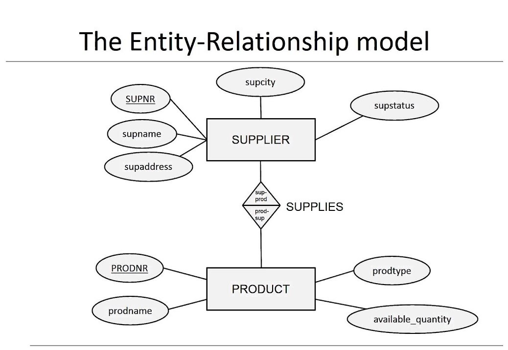

Defining relationships between entities:
* one-to-one relationship
* one-to-many relationship
* many-to-many relationship

**ER Diagrams** are basic foundation for designing a database. Begin with ERD, and map the ERD to the table.

Which of the following statements about Entity Relationship Diagrams (ERD) is true? -- attributes in an ERD are mapped to columns in a relational table; entities in an ERD are mapped to tables in a relational table

In a relation: **degree** = the number of attributes in a relation; **cardinality** = the number of tuples. Rows in a relational instance (or a table) are also known as Tuples. If a table has 4 columns and 8 rows then its cardinality is 4.

*Quiz*

```
CAR DEALERSHIP DATABASE
CAR: serial_no, model, manufacturer, price
SALE: salesperson_id, serial_no, date, sale_price
SALESPERSON: salesperson_id, name, phone
```
1. How many relations does the Car Dealership Schema contain? -- **3**
2. How many attributes does the relation CAR contain? -- **4**
3. What is the degree of the relation Salesperson? -- **3**

*Quiz*

1. Advantages of the relational model include: -- **it is the most used data model; data is stored in simple data structures such as tables; provides logical and physical data independence**
2. A table containing one or more foreign keys is called a Dependent table. -- **True**
3. The Primary Key of a relational table uniquely identifies each __ in a table. -- **row**


## Databases and SQL for Data Science -- Week 2

Retrieving rows from a table

```
SELECT * FROM BOOK;
SELECT BOOK_ID, TITLE FROM BOOK;
SELECT BOOK_ID, TITLE FROM BOOK WHERE BOOK_ID='B1'
```

In a relational database, we can use string patterns to search data rows that match this condition. The **LIKE** predicate is used in a WHERE clause to search for a pattern in a column. We can also use the comparison operators or **BETWEEN AND** in a WHERE clause (the values in the range are inclusive). We can use **IN** operator to specify a set of values in a WHERE clause.

```
SELECT FIRSTNAME FROM AUTHOR WHERE FIRSTNAME LIKE 'R%';
SELECT TITLE, PAGES FROM BOOK WHERE PAGE >= 290 AND PAGES <= 300;
SELECT TITLE, PAGES FROM BOOK WHERE PAGES BETWEEN 290 AND 300;
SELECT FIRSTNAME, LASTNAME, COUNTRY FROM AUTHOR WHERE COUNTRY='AU' OR COUNTRY='BR';
SELECT FIRSTNAME, LASTNAME, COUNTRY FROM AUTHOR WHERE COUNTRY IN ('AU', 'BR')
```

To display the result set in alphabetical order, we add the **ORDER BY** clause to the SELECT statement (ascending by default; descending using **DESC**). In addition, we can specify column sequence number in ORDER BY clause.

```
SELECT TITLE FROM BOOK ORDER BY TITLE;
SELECT TITLE FROM BOOK ORDER BY TITLE DESC;
SELECT TITLE, PAGES FROM BOOK ORDER BY 2; (order by pages)
```

To eliminate duplicates in the result set, we use the keyword **DISTINCT**. Besides, the **GROUP BY** clause groups a result set into subsets that has matching values for one or more columns. We can further restrict the number of rows with **HAVING** clause in the GROUP BY clause.

```
SELECT DISTINCT(COUNTRY) FROM AUTHOR;
SELECT COUNTRY, COUNT(COUNTRY) FROM AUTHOR GROUP BY COUNTRY;
SELECT COUNTRY, COUNT(COUNTRY) AS COUNT FROM AUTHOR GROUP BY COUNTRY;
SELECT COUNTRY, COUNT(COUNTRY) AS COUNT FROM AUTHOR GROUP BY COUNTRY HAVING COUNT(COUNTRY) > 4
```

*Quiz*

1. You want to select author's last name from a table, but you only remember the author's last name starts with the letter B, which string pattern can you use? -- ```SELECT FIRSTNAME FROM AUTHOR WHERE LASTNAME LIKE 'B%'```
2. In a SELECT statement, which SQL clause controls how the result set is displayed? -- **ORDER BY clause**
3. Which SELECT statement eliminates duplicates in the result set? -- ```SELECT DISTINCT(COUNTRY) FROM AUTHOR```
4. What is the default sorting mode of the ORDER BY clause? -- **ascending**
5. Which of the following can be used in a SELECT statement to restrict a result set? -- **HAVING / WHERE / DISTINCT**

Most databases come with built-in SQL functions. Built-in functions can be included as part of SQL statements. Database functions significantly reduce the amount of data that needs to be retrieved. Built-in functions can speed up data processing.

**Aggregate or Column Functions**

* INPUT: collection of values (e.g. entire column)
* OUTPUT: single value
* e.g. SUM(), MIN(), MAX(), AVG() etc

```
SELECT SUM(SALESPERSON) FROM PETSALE;
SELECT SUM(SALESPERSON) AS SUM_OF_SALESPERSON FROM PETSALE;
SELECT MAX(QUANTITY) FROM PETSALE;
SELECT MIN(ID) FROM PETSALE WHERE ANIMAL='DOG';
SELECT AVG(SALEPRICE) FROM PETSALE;
SELECT AVG(SALEPRICE / QUANTITY) FROM PETSALE WHERE ANIMAL='DOG'
```

**Scaler and String Functions**

performs operations on every input values. e.g. ROUND(), LENGTH(), UCASE(), LCASE() etc

```
SELECT ROUND(SALEPRICE) FROM PETSALE;   round up/down every value
SELECT LENGTH(ANIMAL) FROM PETSALE;     retrieve length of each value
SELECT UCASE(ANIMAL) FROM PETSALE;
SELECT * FROM PETSALE WHERE LCASE(ANIMAL)='cat';
SELECT DISTINCT(UCASE(ANIMAL)) FROM PETSALE
```

**Date and Time Functions**

Most databases contain special data types for dates and times.
* DATE ```YYYYMMDD```
* TIME ```HHMMSS```
* TIMESTAMP ```YYYYMMDDHHMMSSZZZZZZ```

Date / Time functions: ```YEAR(), MONTH(), DAY(), DAYOFMONTH(), DAYOFWEEK(), DAYOFYEAR(), WEEK(), HOUR(), MINUTE(), SECOND()```

Special registers: ```CURRENT_DATE, CURRENT_TIME```

```
SELECT DAY(SALEDATE) FROM PETSALE WHERE ANIMAL='CAT';
SELECT COUNT(*) FROM PETSALE WHERE MONTH(SALEDATE)='05';
SELECT (SALEDATE + 3 DAYS) FROM PETSALE;
SELECT (CURRENT_DATE - SALEDATE) FROM PETSALE)
```

**Sub-query** is a query inside another query. This allows you to form more powerful queries than would have been otherwise possible.

```
SELECT COLUMN1 FROM TABLE WHERE COLUMN2 = (SELECT MAX(COLUMN2) FROM TABLE);
SELECT EMP_ID, F_NAME, L_NAME, SALARY FROM EMPLOYEES WHERE SALARY < (SELECT AVG(SALARY) FROM EMPLOYEES);
SELECT EMP_ID, SALARY, (SELECT AVG(SALARY) FROM EMPLOYEES) AS AVG_SALARY FROM EMPLOYEES;
SELECT * FROM (SELECT EMP_ID, F_NAME, L_NAME, DEP_ID FROM EMPLOYEES) AS EMP4ALL
```

There are several ways to access multiple tables in the same query:
1. sub-queries
2. implicit JOIN
3. JOIN operators (INNER JOIN, OUTER JOIN, etc)

```
SELECT * FROM EMPLOYEES WHERE DEP_ID IN (SELECT DEPT_ID_DEP FROM DEPARTMENTS);
SELECT * FROM EMPLOYEES WHERE DEP_ID IN (SELECT DEPT_ID_DEP FROM DEPARTMENTS WHERE LOC_ID='L0002');
SELECT DEPT_ID_DEP, DEP_NAME FROM DEPARTMENTS WHERE DEPT_ID_DEP IN (SELECT DEP_ID FROM EMPLOYEES WHERE SALARY > 70000);
SELECT * FROM EMPLOYEES, DEPARTMENTS; (full join / Cartesian join / every row in 1st is joined with every row in 2nd)
SELECT * FORM EMPLOYEES, DEPARTMENTS WHERE EMPLOYEES.DEP_ID=DEPARTMENTS.DEPT_ID_DEP;
SELECT * FROM EMPLOYEES E, DEPARTMENTS D WHERE E.DEP_ID=D.DEPT_ID_DEP;
SELECT EMPLOYEES.EMP_ID, DEPARTMENTS.DEPT_NAME FROM EMPLOYEES E, DEPARTMENTS D WHERE E.DEP_ID=D.DEPT_ID_DEP;
SELECT E.EMP_ID, D.DEP_ID_DEP FROM EMPLOYEES E, DEPARTMENTS D WHERE E.DEP_ID=D.DEPT_ID_DEP
```

*Quiz*

1. Which of the following will retrieve the LOWEST value of SALARY in a table called EMPLOYEES? -- ```SELECT MIN(SALARY) FROM EMPLOYEES```
2. Assume there exists an INSTRUCTOR table with several columns including FIRSTNAME, LASTNAME, etc. Which of the following is the most likely result set for the following query? SELECT DISTINCT(FIRSTNAME) FROM INSTRUCTOR -- **LEON / PAUL / JOE**
3. Which of the following queries will return the first name of the employee who earns the highest salary? -- ```SELECT FIRST_NAME FROM EMPLOYEES WHERE SALARY=(SELECT MAX(SALARY) FROM EMPLOYEES)```
4. Which of the following queries will return the data for employees who belong to the department with the highest value of department ID? -- ```SELECT * FROM EMPLOYEES WHERE DEP_ID=(SELECT MAX(DEPT_ID_DEP) FROM DEPARTMENTS)```
5. A DEPARTMENTS table contains DEP_NAME, and DEPT_ID_DEP columns and an EMPLOYEES table contains columns called F_NAME and DEP_ID. We want to retrieve the Department Name for each Employee. Which of the following queries will correctly accomplish this? -- ```SELECT D.DEP_NAME, E.F_NAME FROM DEPARTMENTS D, EMPLOYEES E WHERE D.DEPT_ID_DEP=E.DEP_ID```

A **Foreign Key** is a set of columns referring to a primary key of another table. It is the **Primary Key** which uniquely identifies a row in a table.
* Parent Table: a table containing a Primary Key that is related to at least one Foreign Key
* Dependent Table: a table containing one or more Foreign Keys

The following six constraints are defined in a relational database model:
1. entity integrity constraint
2. referential integrity constraint
3. semantic integrity constraint
4. domain constraint
5. null constraint
6. check constraint

If a Primary Key was allowed to have NULL values the Entity Integrity Constraint of a table could be violated. The Referential Integrity ensures the validity of the data using a combination of Primary Keys and Foreign Keys.

*Quiz*

1. Which Relational Constraint prevents duplicate rows in a table? -- **Entity Integrity Constraint**
2. Which Relational Constraint ensures the validity of the data using a combination of Primary Keys and Foreign Keys? -- **Referential Integrity Constraint**
3. Which of the following statements are correct about the primary keys? -- **the value of the Primary Key must be unique for each instance of the entity; the Primary Key is immutable, i.e., once created the value of the Primary Key cannot be changed; Primary Keys cannot have missing or NULL values**
4. Which of the following statement is true? -- **a Foreign Key refers to a Primary Key of another table**


## Databases and SQL for Data Science -- Week 3

There are many benefits of Python for database programming:
* ecosystem: NumPy, Pandas, matplotlib, SciPy
* ease of use
* portable
* database APIs
* support for relational database systems
* detailed documentation

Notebooks are very popular in the field of data science because they run in an environment that allows creation and sharing of documents that contain live code, equations, visualizations and explanatory texts. A notebook interface is a virtual notebook environment used for programming.

SQL API consists of a library of function calls as an application programming interface (API) for the DBMS.


Two concepts of the Python DB API:
* connection objects
  * database connections
  * manage transaction
* cursor objects
  * database queries

Cursors created from the same connection are not isolated, i.e. any changes done to the database by a cursor are immediately visible to the other cursors. Cursors created from different connections can or cannot be isolated depending on how the transaction support is implemented.

A database cursor is a control structure that enables traversal over the records in a database. It behaves like a file name or file handle in a programming language.

```
from dbmodule import connect

# create connection object
Connection = connection('databasename', 'username', 'pswd')

# create a cursor object
Cursor = Connection.cursor()

# run queries
Cursor.execute('SELECT * FROM MYTABLE')
Results = Cursor.fetchall()

# free resources
Cursor.close()
Connection.close()
```

The ```ibm_db``` API provides a variety of useful Python functions for accessing and manipulating data in an IBM data server Database.

The ```ibm_db.exec_immediate()``` function prepares and executes a SQL statement. The parameters passed to the ```ibm_db.exec_immediate``` function include: connection; statement; options.

*Quiz*

1. A database cursor is a control structure that enables traversal over the records in a database. -- **True**
2. The ```ibm_db``` API provides a variety of useful Python functions for accessing and manipulating data in an IBM data server like Db2. -- **True**
3. A DataFrame represents a tabular, spreadsheet-like data structure containing an ordered collection of columns, each of which can be a different value type. A pandas dataframe in Python can be used for storing the result set of a SQL query. -- **True**
4. Which of the following statement about Python is NOT correct? -- **due to its proprietary nature, database access from Python is not available for many databases**
5. To query data from tables in database a connection to the database needs to be established. Which of the following is NOT required to establish a connection with a relational database from a Python network. -- **table and column names**

A simple SELECT statement retrieves data from one or more columns from a single table. The next level of complexity is retrieving data from two or more tables. To combine data from two tables, we use **JOIN** operator: 1) combines row from two or more tables; 2) based on a relationship.

* PrimaryKey-ForeignKey is the common JOIN operator
* JOIN operator is used to combine more than one table
* You have to know the relationship between the tables

**INNER JOIN**
> most popular

An INNER JOIN operation returns only data from the rows in the tables that match the inner join criteria.

```
SELECT B.BORROWER_ID, B.LASTNAME, B.COUNTRY, L.BORROWER_ID, L.LOAN_DATE 
    FROM BORROWER B INNER JOIN LOAN L ON B.BORROWER_ID=L.BORROWER_ID
SELECT B.LASTNAME, L.COPY_ID, C.STATUS
    FROM BORROWER B INNER JOIN LOAN L ON B.BORROWER_ID=L.BORROWER_ID
                    INNER JOIN COPY C ON L.COPY_ID=C.COPY_ID
```

**LEFT OUTER JOIN**

A LEFT (OUTER) JOIN operation matches the results from two tables and displays *all the rows from the left table*, and combines the information with rows from the right table that matches the criteria specified in the query.

```
SELECT B.BORROWER_ID, B.LASTNAME, B.COUNTRY, L.BORROWER_ID, L.LOAN_DATE
    FROM BORROWER B LEFT JOIN LOAN L ON B.BORROWER_ID=L.BORROWER_ID
```

When using a LEFT JOIN, if the right table does not have a corresponding value, a NULL value was returned.

**RIGHT OUTER JOIN**

A RIGHT (OUTER) JOIN operation matches the results from two tables and displays *all the rows from the right table*, and combines the information with rows from the left table that matches the criteria specified in the query.

```
SELECT B.BORROWER_ID, B.LASTNAME, B.COUNTRY, L.BORROWER_ID, L.LOAN_DATE
    FROM BORROWER B RIGHT JOIN LOAN L ON B.BORROWER_ID=L.BORROWER_ID
```

If you do not specify what type of OUTER JOIN you want to perform, it defaults to RIGHT OUTER JOIN. -- False (you need to specify which type of OUTER JOIN you want to perform - LEFT, RIGHT OR FULL)

**FULL OUTER JOIN**

The FULL (OUTER) JOIN operation returns all rows from both tables, all rows from the left table and all rows from the right table. So, the FULL JOIN could return a very large result set.

```
SELECT B.BORROWER_ID, B.LASTNAME, B.COUNTRY, L.BORROWER_ID, L.LOAN_DATE
    FROM BORROWER B FULL JOIN LOAN L ON B.BORROWER_ID=L.BORROWER_ID
```

*Quiz*

1. An INNER JOIN returns only the rows that match. -- **True**
2. A LEFT OUTER JOIN displays all the rows from the right table, and combines matching rows from the left table. -- **False**
3. When using an OUTER JOIN, you must explicitly state what kind of OUTER JOIN you want - a LEFT JOIN, a RIGHT JOIN, or a FULL JOIN. -- **True**
4. Which of the following are valid types of JOINs? -- **LEFT OUTER JOIN, RIGHT OUTER JOIN, FULL OUTER JOIN**
5. A FULL JOIN returns only the rows that match. -- **False**


## Databases and SQL for Data Science -- Week 4

Many of the real-world datasets are made available as .csv files. These are text files which contain data values typically separated by commas.

When querying column names with mixed (upper and lower) case, we can use double quotes to specify mixed-case column names. By default, spaces are mapped to underscores. Other characters may also get mapped to underscores.

```
SELECT "Id", "Name_of_Dog", "Breed__dominant_breed_if_not_pure_breed_" FROM DOGS
```

We can use backslash \ as the escape character in cases where the query contains single quotes.

```
selectQuery = 'SELECT * FROM DOGS WHERE "Name_of_Dog"=\'Huggy\''
```

We can use backslash \ to split the query into multiple lines.

```
%sql SELECT "Id", "Name_of_Dog", \
    FROM DOGS \
    WHERE "Name_of_Dog"='Huggy'
```

Or we can use ```%%sql``` in the first row of the cell in the notebook.

```
%%sql
SELECT "Id", "Name_of_Dog",
    FROM DOGS
    WHERE "Name_of_Dog"='Huggy'
```


## Data Analysis with Python -- Week 1

Importance of Data Analysis: data is everywhere; data analysis helps us answer questions from data; discovering useful information; answering questions; predicting future or the unknown

*Quiz*

1. What does .csv file stand for? -- **common separated values**
2. Each column contains a -- **attribute or feature**

Python Packages for Data Science includes
* Scientific computing libraries in Python: Pandas / Numpy / Scipy
* Visualization libraries in Python: Matplotlib / Seaborn
* Algorithmic libraries in Python: Scikit-learn / Statsmodels

*Quiz*

1. What is a Python Library? -- **a collection of functions and methods that allows you to perform lots of actions without writing your code**
2. Scikit-learn is used for -- **statistical modelling including regression and classification**

Data acquisition is a process of loading and reading data into notebook from various sources. Two important factors to consider in importing data using Python: format and file path.

```df.head(n)``` to show the first n rows of dataframe; ```df.tail(n)``` to show the bottom n rows of dataframe.

*Quiz*

1. What is the file path? -- **the file path tells us where the data is stored**
2. What task does the following lines of code perform? ```path='xxx'; df.to_csv(path)``` -- **exports your Pandas dataframe to a new .csv file, in the location specified by the variable path**

There are some basic insights from the data once you load the data:
* understand your data before you begin any analysis
* check data types 
  * potential info and type mismatch / compatibility with Python method 
  * ```df.dtypes```
* check data distribution 
  * ```df.describe()``` returns a statistical summary 
  * ```df.info()``` provides a concise summary of the dataframe
* locate potential issues with the data

*Quiz*

1. What is the name of what we want to predict? -- **target**
2. What does .csv stand for? -- **comma separated values**
3. What library is primarily used for data analysis? -- **pandas**
4. Select the libraries you will use for this course? -- **matplotlib; pandas; scikit-learn**
5. What is the command to display the first five rows of a dataframe df? -- ```df.head()```
6. What task does the following command perform? ```df.to_csv("A.csv")``` -- **save the dataframe df to a .csv file called "A.csv"**
7. What attribute or method will give you the data type of each column? -- **dtypes**
8. How would you generate descriptive statistics for all the columns for the dataframe df? -- ```df.describe(include='all')```


## Data Analysis with Python -- Week 2

Data pre-processing, AKA data cleaning or data wrangling, is the process of converting or mapping data from the initial raw form into another format, in order to prepare the data for further analysis.

**Dealing with Missing Values in Python**

Missing values occur when no data value is stored for a variable (feature) in an observation. Missing values could be represented as "?", "N/A", 0 or just a blank cell.

1. Check the data collection source
2. Drop the missing values (variable / data entry)
3. Replace the missing values (with average / by frequency (mode) / based on functions)
4. Leave it as missing data

* Use ```dataframes.dropna(inplace=True)``` to drop missing values;
* Use ```dataframes.replace(miss_val, new_val)``` to replace missing values;

*Quiz*

1. How would you access the column "symboling" from the dataframe df? -- ```df["symboling"]```
2. How would you replace the missing values in the column "normalized-losses" with the mean of that column? -- ```mean=df["normalized-losses"].mean(); df["normalized-losses"].replace(np.nan, mean)```
3. What is the correct symbol for missing data? -- **nan**

**Data Formatting in Python**

Data formatting means bringing data into a common standard of expression that allows users to make meaningful comparison. Data formatting ensures the data is consistent and easily understandable. 

* non-formatted: confusing / hard to aggregate / hard to compare
* formatted: more clear / easy to aggregate / easy to compare

```
df["city-mpg"] = 235 / df["city-mpg"]
df.rename(columns={"city-mpg": "city-L/100km"}, inplace=True)
```

Sometimes the wrong data type is assigned to a feature. There are many data types in pandas: objects / int64 / float64.
* To identify data types: ```dataframe.dtypes()```
* To convert data types: ```dataframe.astype()```

*Quiz*

1. How would you multiply each element in the column df["a"] by 2 and assign it back to the column df["a"]? -- ```df["a"] = 2*df["a"]```
2. How would you rename the column "city_mpg" to "city-L/100km"? -- ```df.rename(columns={"city_mpg": "city-L/100km"}, inplace=True)```

**Data Normalization in Python**

Data normalization refers to uniforming the features value with different range. By making the ranges consistent between variables, normalization enables a fair comparison between the different features, making sure they have the same impact.

There are several approaches for normalization:
1. feature scaling ([0,1]) ```df["len"] = df["len"]/df["len"].max()```
2. min-max ([0,1]) ```df["len"] = (df["len"]-df["len"].min()) / (df["len"].max()-df["len"].min())```
3. z-score (hover around 0) ```df["len"] = (df["len"]-df["len"].mean()) / df["len"].std()```

*Quiz*

1. What is the maximum value for feature scaling? -- 1
2. Consider the column "length", select the correct code for simple feature scaling. -- ```df["length"] = df["length"]/df["length"].max()```

**Binning in Python**

Binning is a method of data pre-processing when you group values together into bins. We use binning to convert numeric variables into categorical variables for improved accuracy in the predictive models. In addition, we use data binning to group a set of numerical values into a smaller number of bins to have a better understanding of the data distribution.

```
bins = np.linspace(min(df["price"]), max(df["price"]), 4)
group_names = ["low", "medium", "high"]
df["price_binned"] = pd.cut(df["price"], bins, labels=group_names, include_lowest=True)
```

**Turning categorical variables into quantitative variables in Python**

Most statistical modes cannot take in objects or strings as input and for model training only take the numbers as inputs. We encode the values by adding new features corresponding to each unique element in the original feature we would like to encode.

categorical -> numeric: add dummy variables for each unique category / assign 0 or 1 in each category (**ONE-HOT ENCODING**)

Use ```pandas.get_dummies()``` method to convert categorical variables to dummy variables (0 / 1). E.g. ```pd.get_dummies(df['fuel'])```

*Quiz*

1. Why do we convert values of categorical values into numerical values? -- **most statistical models cannot take in objects or strings as inputs**
2. What is the correct line of code to perform one-hot encoding on the column "fuel"? -- ```pd.get_dummies(df['fuel'])```

*Quiz*

1. What task does the following line of code perform? ```df['peak-rpm'].repalce(np.nan, 5, inplace=True)``` -- **replace the not a number values with 5 in the column 'peak-rpm'**
2. What task do the following lines of code perform? ```avg=df['bore'].mean(axis=0); df['bore'].replace(np.nan, avg, inplace=True)``` -- **calculate the mean value for the 'bore' column and replace all the NaN values of that column by the mean value**
3. Consider the dataframe df, convert the column df['city-mpg'] to df['city-L/100km'] by dividing 235 by each element in the column 'city-mpg'. -- ```df['city-L/100km'] = 235 / df['city-mpg']```
4. What data type is the following set of numbers? 666, 1.1, 232, 23.12 -- **float**
5. The following code is an example of ```(df['len']-df['len'].mean()) / df['len'].std()``` -- **z-score**


## Data Analysis with Python -- Week 3

Exploratory data analysis (EDA) is a preliminary step in data analysis to 1) summarize main characteristics of the data; 2) gain better understanding of the dataset; 3) uncover relationships between different variables; 4) extract important variables for the problem we are trying to solve.

Descriptive statistics describe basic features of data and give short summaries about the sample and measures of the data. 
* summarize statistics using pandas describe() method ```df.describe()```
  * NaN values will be excluded if the method describe() is applied to a dataframe with NaN values
* summarize the categorical data by using the method ```value_counts()```
* visualize numeric data using box plots (visualization of various distributions of the data)
  * median / upper quartile / lower quartile / outlier
* visualize the relationship between two variables as each observation represented as a point
  * predictor / independent variables on x-axis
  * target / dependent variables on y-axis

*Quiz*

1. Select the appropriate table for the following line of code ```df = pd.DataFrame({'A': ["a", "b", "c", "a", "a"]}); df['A'].value_counts()``` -- **a:3 b:1 c:1**
2. Consider the following scatter plot, what kind of relationship do the two variables have? -- **positive linear relationship**

Grouping data can be done using ```dataframe.groupby()``` method
* can be applied on categorical variables
* grouping data into categories
* grouping based on single or multiple variables

```
df_test = df['drive-wheels', 'body-style', 'price']
df_grp = df_test.groupby(['drive-wheels', 'body-style'], as_index=False).mean()
```

Pandas method ```pivot()```: one variable displayed along the columns and the other variable display along the rows.

```
df_pivot = df_grp.pivot(index='drive-wheels', columns='body-style')
```

**Heatmap** is to plot target variable over multiple variables.

```
plt.pcolor(df_pivot, cmap='RdBBu')
plt.colorbar()
plt.show()
```

*Quiz*

1. The following is the output from applying the groupby method. How many different groups are there? -- **3**

**Correlation** is a statistical metric for measuring to what extent different variables are interdependent. E.g. lung cancer -> smoking; rain -> umberlla. Correlation does not imply causation. 

*Quiz*

1. What is Correlation? -- **measures to what extent different variables are interdepedent**

**Pearson Correlation**: to measure the strength of the correlation between two features
* correlation coefficient
  * close to +1: large positive relationship
  * close to -1: large negative relationship
  * close to 0: no relationship
* p-value
  * < 0.001 strong certainty in the result
  * < 0.05 moderate certainty in the result
  * < 0.1 weak certainty in the result
  * \> 0.1 no certainty in the result
* *strong correlation*
  * correlation coefficient close to +1 or -1
  * p-value less than 0.001

Taking all variables into account, we can now create a heatmap that indicates the correlation between each of the variables with one another. This correlation heatmap gives us a good overview of how the different variables are related to one another and, most importantly, how these variables are related to price.

**Analysis of Variance (ANOVA)**: to find the correlation between different groups of a categorical variable
* F-test score: variation between sample group means divided by variation within sample group
  * small F implies poor correltaion between variale categories and target variable
  * large F implies strong correlation between variable categories and target variable
* p-value: confidence degree (whether the obtained result is statistically significant)

For instance, ANOVA between "Honda" and "Subaru":
```
df_anova = df[['make', 'price']]
grouped_anova = df_anova.groupby(['make'])
anova_results_l = stats.f_oneway(grouped_anova.get_group('honda')['price'], grouped_anova.get_group('subaru')['price'])
```
```
ANOVA results: F=0.19744031275, p=F_onewayResult(statistic=0.1974430127), pvalue=0.660947824
```
The prices between Honda's and Subaru are **not** significantly different since the F-score is veryl small (0.197). However, there is a strong correlation between a categorical variable and other variables if the ANOVA test gives us **a large F-test score** and **a small p-value**.

*Quiz*

1. What task does the method value_counts perform? -- **return counts of unique values**
2. What does the vertical axis in a scatter plot represent? -- **dependent** 
3. What is the largest possible element resulting in the operation df.corr()? -- **1**
4. If the p-value of the Pearson Correlation is 1, then -- **the variables are not correlated**
5. Consider the dataframe df, what method provides the summary statistics? -- **df.describe()**
6. What is the minimum possible value of Pearson's Correlation? -- **-1**
7. What is the Pearson Correlation between variables X and Y if X = Y? -- **1**


## Data Analysis with Python -- Week 4

A model can be thought of as a mathematical equation used to predict a value given one or more other values. Usually the more relevant data you have the more accuracte your model is.

* Linear regression refers to one independent variable to make a prediction
* Multiple linear regression refers to multiple independent variables to make a prediction

**Simple Linear Regression (LR)**

1. the predictor (independent) variable - $x$
2. the target (dependent) variable -$y$

$y = b_0 + b_1 x$  
where $b_0$ is the intercept and $b_1$ is the slope

**Multiple Linear Regression (MLR)**

is used to explain the relationship between:
* one continuous target (Y) variable
* two or more predictor (X) variables

$Y = b_0 + b_1x_1 + b_2x_2 + b_3x_3 + ...$  
where $b_0$ is the intercept (X=0) and $b_1$ is the *coefficient* or *parameter* of $x_1$ and $b_2$ is the *coefficient* or *parameter* of $x_2$ and so on.

*Quiz*

1. Consider the following lines of code, what is the name of the column that contains the target values? ```Y = df['price']``` -- **'price'**
2. Consider the following equation, what is the parameter $b_0$? $y = b_0 + b_1x$ -- **the intercept**

**Regression plot** gives us a good estimate of 1) relationship between two variables; 2) the strength of the correlation; 3) the direction of the relationship (positive or negative)

**Regression plot** shows us a combination of 
* the scatterplot: where each point represents a different y
* the fitted linear regression line y'

```
import seaborn as sns
sns.regplot(x='highway-mpg', y='price', data=df)
plt.ylim(0,)
```

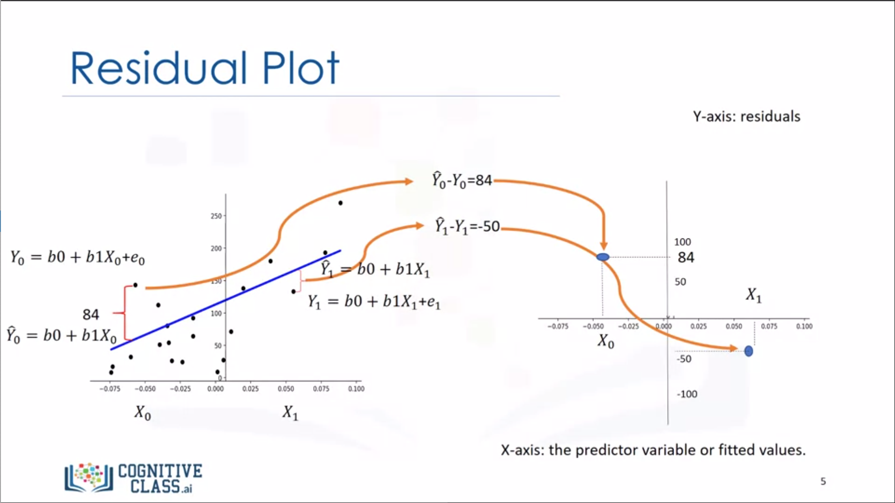

Attention on the spread of the residuals: Randomly spread out around x-axis then a linear model is appropriate.

**Distribution plot** shows us a combination of 
* the fitted values that result from the model
* the actual values (groundtruth)

```
import seaborn as sns
ax1 = sns.distplot(df['price'], hist=False, color='r', label='Actual Value')
sns.distplot(Yhat, hist=False, color='r', label='Fitted Value', ax=ax1)
```

*Quiz*

1. Consider the following Residual Plot, is our linear model correct? -- **yes (randomly spread out around x-axis)**
2. Select the distribution plot that demonstrates the best-predicted values compared to actual values -- **b**

**Polynomial regression** is a special case of the general linear regression model. It is useful for describing curvilinear relationships.
* quadratic -- 2nd order
* cubic -- 3rd order
* higher order

```
f = np.polyfit(x, y, 3)
p = np.polydl(f)
print(p)
```

We can also have multi-dimensional polynomial linear regression  
$Y = b_0 + b_1X_1 + b_2X_2 + b_3X_1X_2 + b_4X_1^2 + b_5X_2^2$

```
from sklearn.preprocessing import PolynomialFeatures
pr = PolynomialFeatures(degree=2)
x_polly = pr.fit_transform(x[['horsepower', 'curb-weight']], include_bias=False)
```

As the dimension of the data gets larger, we may want to normalize multiple features.

**Pipeline** sequentially perform a series of transformations and the last step carries out a prediction. A pipeline typically contains:
1. normalization
2. polynomial transform
3. linear regression

```
Input = [('scale', StandardScaler()), ('polynomial', PolynomialFeatures(degree=2)), ('mode', LinearRegression())]
pipe = Pipeline(Input) # a pipeline object
pipe.train(X['horsepower', 'curb-weight', 'engine-size', 'highway-mpg'], y)
yhat = pipe.predict(X[['horsepower', 'curb-weight', 'engine-size', 'highway-mpg']])
```

*Quiz*

1. What functions are used to generate Polynomial Regression with more than one dimension? -- ```pr = PolynomialFeatures(degree=2); pr.fit_transform([1,2], include_bias=False```
2. Select the line of code that imports the module required for polynomial features. -- ```from sklearn.preprocessing import PolynomialFeatures```

The measures that we use for in-sample evaluation are a way to numerically determine how good the model fits on our data. Two important measures are: **Mean Squared Error(MSE)** and **R-squared (or coefficient of determination)**.
* To measure the MSE, we find the difference between the actual values and the predicted values then square it.
```
from sklearn.metrics import mean_squared_error
mean_squared_error(Y, Yhat)
```
* R-squared is a measure to determine how close the data is to the fitted regression line. $R^2 = (1 - \frac{MSE_{regression}}{MSE_{dataaverage}})$ So $R^2$ is in range [0,1]
```
lm = LinearRegression()
lm.fit(X, Y)
lm.score(X, y)
```

*Quiz*

1. Consider the following lines of code, what value does the variable ```out``` contain? ```lm = LinearRegression(); lm.fit(X, Y); out=lm.score(X, y)``` -- **the coefficient of determination or $R^2$**
2. Select the correct function to calculate the mean squared error between yhat and y? -- ```from sklearn.metrics import mean_squared_error; mean_squared_error(y, yhat)```

Decision Making: determining a good model fit
* do the predicted values make sense?
* visualization (regression plot / residual plot)
* numerical measures for evaluation (MSE, $R^2$)
* comparing models

*Quiz*

1. If the predicted function is $y = b_0 + b_1x_1 + b_2x_2 + b_3x_3 + b_4x_4$. The method is: -- **multiple linear regression**
2. What steps do the following lines of code perform? ```Input=[('scale',StandardScaler()),('model',LinearRegression())]; pipe=Pipeline(Input); pipe.fit(Z,y); ypipe=pipe.predict(Z)``` -- **standardize the data, then perform a prediction using a linear regression model using the features z and targets y**
3. We create a polynomial feature as follows "PolynomialFeatures(degree=2)", what is the order of the polynomial? -- **2**
4. What value of $R^2$ (coefficient of determination) indicates your model performs best? -- **1**
5. The larger the mean squared error, the better your model has performed. -- **False**
6. Consider the following equation: $y = b_0 + b_1x$. The value y is what? -- **the target or dependent variable**


## Data Analysis with Python -- Week 5

In-sample evaluation tells us how well our model will fit the data used to train it. It does not tell us how well the trained model can be used to predict new data.
* In-sample data or **training data**
* Out-of-sample evaluation or **test set**

Build and train the model with a **training set**, and use **test set** to assess the performance of the predictive model.

```
X_train, X_test, y_train, y_test = train_test_split(X_data, y_data, test_size=0.3, random_state=0)
```

**Cross Validation** is the most common out-of-sample evaluation metrics, and it enables more effective use of data (each observaion is used for both training and testing).

```
from sklearn.model_selection import cross_val_score
scores = cross_val_score(lr, X_data, y_data, cv=10)
np.mean(scores)
```

```cross_val_predict()``` returns the prediction that was obtained for each element when it was in the test set.

```
from sklearn.model_selection import cross_val_predict
yhat = cross_val_predict(lr2e, X_data, y_data, cv=10)
```

*Quiz*

1. What is the correct use of the "train_test_split" function such that 90% of the data samples will be utilized for training, the parameter "random_state" is set to zero, and the input variables for the features and targets are X_data, y_data respectively? -- ```train_test_split(X_data, y_data, test_size=0.1, random_state=0)```
2. What is the problem with the in-sample evaluation? -- **it does not tell us how the trained model can be used to predict new data**

How to do the model selection
* Underfitting, where the model is too simpe to fit the data.
* Overfitting, where the model is too flexible and fits the noise rather than function.

Noise term is one reason for the error (becuase the rror is random, we cannot predict it), and it is also reffered to as **irreducible error**.

*Quiz*

1. What model should you select? -- **b (not underfitting or overfitting)**
2. The following is an example of? -- **underfitting**

**Ridge Regression** is useful to prevent overfitting. Ridge regression controls the magnitude of these polynomial coefficients by introducing the parameter alpha. Alpha is a parameter, or **hyperparameter**, that we select before ftting or training the model.

```
from sklearn.linear_model import Ridge
RidgeModel = Ridge(alpha=0.1)
RidgeModel.fit(X, y)
yhat = RidgeModel.predict(X)
```

*Quiz*

1. Select the model with the optmimum value of alpha. -- **b**
2. The following models were all trained on the same data, select the model with the heighest value for alpha. -- **c**

**Grid Search** allows us to scan through multiple free parameters with few lines of code. Scikit-learn has a means of automatically iterating over these hyperparameters using cross-validation called **Grid Search**.

We use the validation data to pick the best hyperparameters.

```
from sklearn.linear_model import Ridge
from sklearn.model_selection import GridSearchCV

parameters1 = [{'alpha': [0.001, 0.1, 1.0, 100], 'normalize': [True, False]}]
RR = Ridge()
Grid1 = GridSearchCV(RR, parameters1, cv=10)
Grid1.fit(X_data[['horsepower', 'curb-weight', 'engine-size', 'highwat-mpg']], y_data)
Grid1.best_estimator_
scores = Grid1.cv_results_
scores['mean_test_score]
```

*Quiz*

1. What is the correct use of the "train_test_split" function such that 40% of the data samples will be utilized for testing, the parameter "random_state" is set to zero, and the input variables for the features and targets are X_data, y_data respectively? -- ```train_test_split(X_data, y_data, test_size=0.4, random_state=0)```
2. What is the correct use of the "train_test_split" function such that 40 samples will be utilized for testing, the parameter "random_state" is set to zero, and the input variables for the features and targets are X_data, y_data respectively? -- ```train_test_split(X_data, y_data, test_size=40, random_state=0)```
3. What is the code to create a ridge regression object RR with an alpha term equal to 10? -- ```RR = Ridge(alpha=10)```
4. What dictionary value would we use to perform a grid search to determine if normalization should be used and for testing the following values of alpha 1, 10, 100? -- ```[{'alpha': [1,10,100], 'normalize':[True,False]}]```
5. You have a linear model: the average R^2 value on your training data is 0.5, you perform a 100th order polynomial transform on your data then use these values to train another model. After this step, your average R^2 is 0.99, which of the following comments is correct? -- **the results on your training data is not the best indicators of how your model performs; you should use your test data to get a better idea**
6. The following is an example of what? -- **overfitting**
7. The following is an example of what? -- **underfitting**


## Data Visualization with Python -- Week 1

Data visualization is a way to show a complex data in a form that is graphical and easy to understand. But why?
* for exploratory data analysis
* communicate data clearly
* share unbiased representation of data
* use them to support recommendations to different stakeholders

When creating a visual, always remember these best practices:
1. less is more effective
2. less is more attractive
3. less is more impactive

Matplotlib Architecture has three main layers: 1) **Backend Layer**; 2) **Artist Layer**; 3) **Scripting Layer**.

**Backend layer** has three built-in abstract interface classes:
1. FigureCanvas: ```matplotlib.backend_bases.FigureCanvas```
    * encompasses the area onto which the figure is drawn
2. Renderer: ```matplotlib.backend_bases.Renderer```
    * knows how to draw on the FigureCanvas
3. Event: ```matplotlib.backend_bases.Event```
    * handles user inputs such as keyboard strokes and mouse clicks

**Artist layer** is comprised of one main object -- Artist: knows how to use the Renderer to draw on the canvas. Title, lines, tick labels, and images, all correspond to individual Artist instances. Two types of Artist objects:
1. primitive: Line2D, Rectangle, Circle, and Text
2. composite: Axis, Tick, Axes, and Figure  
(each compositive artist may contain other composite artists as well as primitive artists)

**Scripting layer** is comprised mainly of pyplot, a scripting interface that is lighter than the Artist layer.

```%matplotlib inline```  
A magic function starts with % in matploblib, and to enforce plots to be rendered within the browser, you pass it inline as the backend.

A **line plot** is a type of plot which displays information as a series of data points called 'markers' connected by straight line segments.

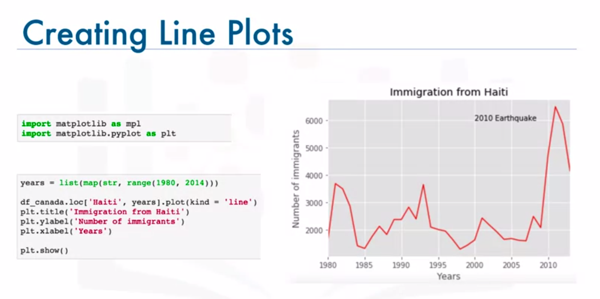

*Quiz*

1. Data visualization is used to explore a given dataset and perform data analytics and build predictive models. -- **False**
2. Matplotlib was created by John Hunter, an American neurobiologist, and was originally developed as an EEG/ECoG visualization tool. -- **True**
3. The Backend, Artist, and Scripting Layers are three layers that make up the Matplotlib architecture. -- **True**
4. Using the notebook backend, you cannot modify a figure after it is rendered. -- **False (you cannot modify the figure using inline backend, but can modify the figure using the notebook backend)**
5. Which of the following are examples of Matplotlib magic functions? -- ```%matplotlib inline``` and ```%matplotlib notebook```


## Data Visualization with Python -- Week 2

A **area plot** is also known as area chart or area graph, and it is commonly used to represent cumulated totals using numbers or percentages over time.

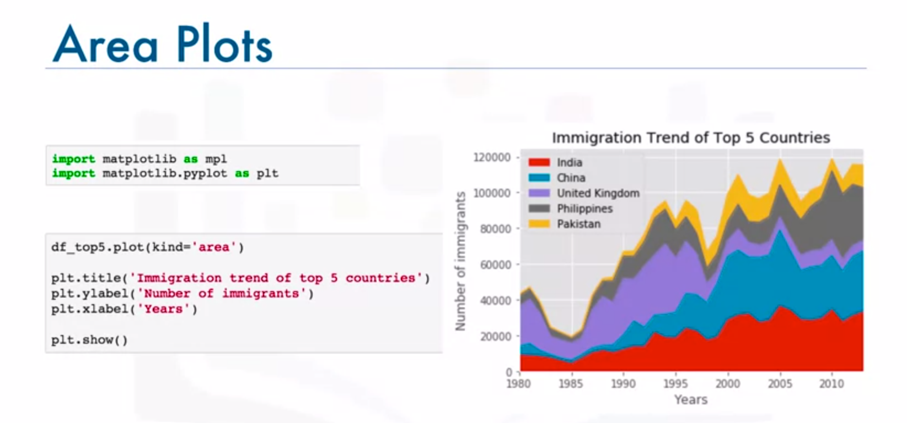

A **histogram** is a way of representing the frequency distribution of a variable.

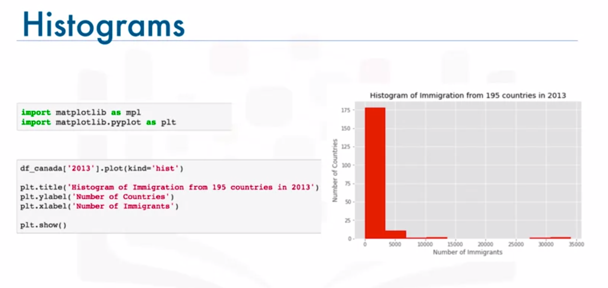

A **bar chart** is commonly used to compare the values of a variable at a given point in time. 

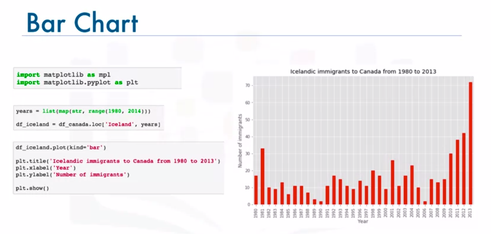

*Quiz*

1. Area plots are stacked by default. -- **True**
2. Which of the following codes uses the artist layer to create a stacked area plot of the data in the pandas dataframe, area_df? -- 
    ```
    ax = area_df.plot(kind='area', figsize=(20,10))
    ax.set_title('xxx')
    ax.set_ylabel('xxx')
    ax.set_xlabel('xxx')
    ```
3. The following code will create an **unstacked** area plot of the data in the pandas dataframe, area_df, with a transparency value of 0.35? -- **False**
    ```
    import matplotlib.pyplot as plt
    transparency = 0.35
    area_df.plot(kind='area', alpha=transparency, figsize=(20,10))
    plt.title('xxx')
    plt.ylabel('xxx')
    plt.xlabel('xxx')
    plt.show()
    ```
4. Given a pandas series, series_data, which of the following will create a histogram of series_data and align the bin edges with the horizontal tick marks? --
   ```
   count, bin_edges = np.histogram(series_data)
   series_data.plot(kind='hist', xticks=bin_edges)
   ```
5. Given a pandas dataframe, question, which of the following will create a horizontal bar chart of the data in question? -- ```question.plot(kind='barh')```

A **pie chart** is a circular statistical graphic divided into slices to illustrate numerical proportion.


> Most argue that pie charts fail to accurately display data with any consistency. Bar charts are much better when it comes to representing the data in a consistent way and getting the message across.

A **box plot** is a way of statistically representing the distribution of given data through five main dimensions： median / first quartile / third quartile / minimum / maximum / (outliers).

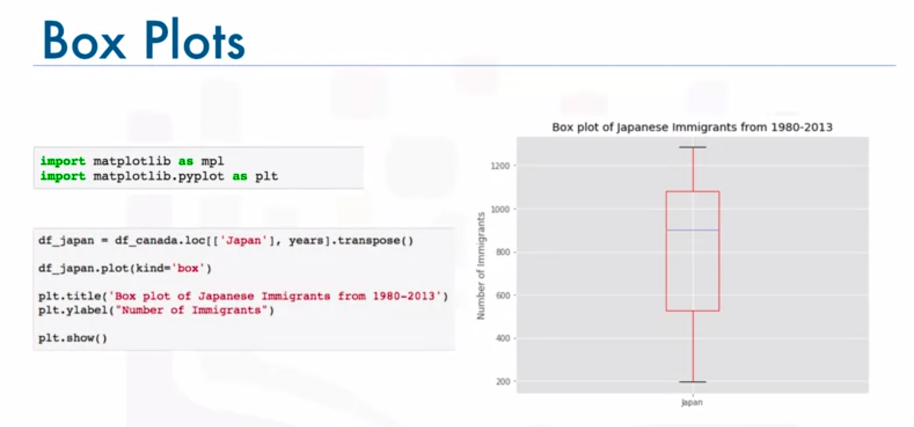

A **scatter plot** is a type of plot that displays values pertaining to typically two variables against each other. Usually it is a dependent variable to be plotted against an independent variable in order to determine if any correlation between the two variables exists.

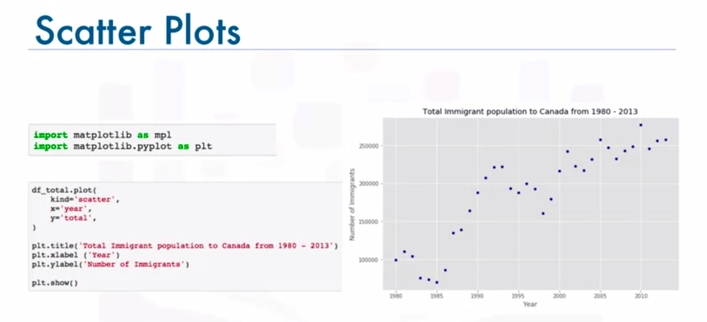

*Quiz*

1. Pie chats are less confusing than bar charts and should be your first attempt when creating a visual. -- **False**
2. What do the letters in the box plot above represent? -- **A = median; B = third quartile; C = first quartile; D = inner quartile range; E = minimum; F = Outliers**
3. What is the correct combination of function and parameter to create a box plot in Matplotlib? -- **function = plot, parameter = kind, with value = 'box'**
4. Which of the lines of code below will create the following scatter plot, given the pandas dataframe df_total? --
    ```
    import matplotlib.pyplot as plt
    df_total.plot(kind='scatter', x='year', y='total')
    plt.title('xxx')
    plt.xlabel('xxx')
    plt.ylabel('xxx')
    plt.show()
    ```
5. A bubble plot is a variation of the scatter plot that displays one dimension of data. -- **False (actually 3 dimensions)**


## Data Visualization with Python -- Week 3

A **waffle chart** is an interesting visualization that is normally created to display progress towards goals.

A **word cloud** is a depiction of the frequency of different words in some textual data. 

Seaborn is a Python visualization library based on Matplotlib. And using Seaborn can effecively reduce the numbre of lines of code to create a plot, e.g. regression plot.

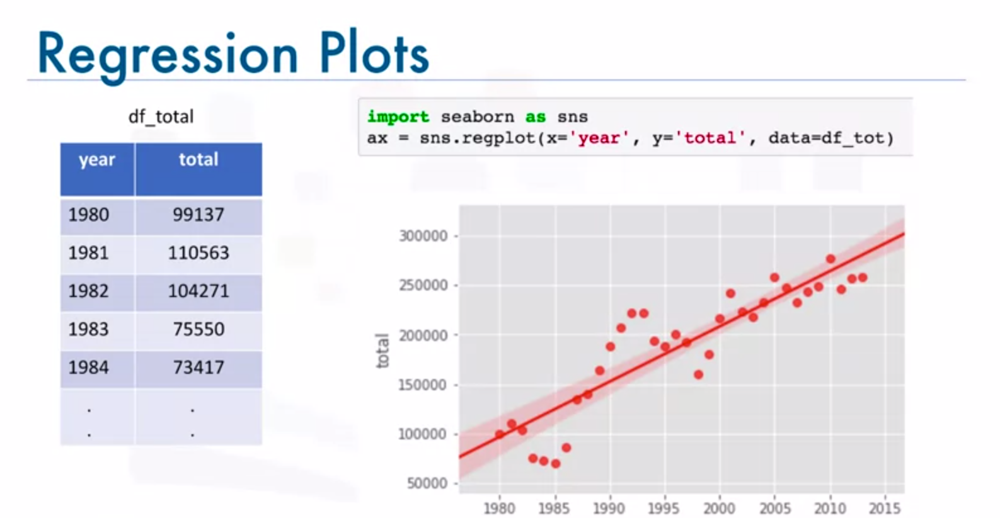

*Quiz*

1. Seaborn is a Python visualization library that provides a high-level interface for drawing attractive statistical graphics, such as regression plots and box plots. -- **True**
2. The following code creates the following regression plot. -- **False (marker)**
3. A regression plot is a great way to visualize data in relation to a whole, or to highlight progress against a given threshold. -- **False (waffle chart)**
4. In Python, creating a waffle chart is straightforward since we can easily create one using the scripting layer of Matplotlib. -- **False**
5. A word cloud -- **is a depiction of the frequency of different words in some textual data; is a depiction of the meaningful words in some textual data, where the more a specific word appears in the text, bigger and bolder it appears in the word cloud; can be generated in Python using the ```word_cloud``` package that was developed by Andreas Mueller**

**Folium** is a powerful Python library that helps you create several types of Leaflet maps. It enables both the binding of data to a map for choropleth visualizations as well as passing visualizations as markers on the map.


A **choropleth map** is a thematic map in which areas are shaded or patterned in proportion to the measurement of the statistical varaible being displayed on the map, such as population density or per capita income. The higher the measurement the darker the color.


*Quiz*

1. Stamen Terrain, Stamen Toner, and Mapbox Bright, are three tile styles of Folium maps. -- **True**
2. Stamen Toner is the right tile style of Folium maps for visualizing and exploring river meanders and coastal zones of a given geographical area. -- **True**
3. You cluster markers, superimposed onto a map in Folium, using a marker cluster object. -- **True**
4. The following code will generate a map of Spain, displaying its hill shading and natural vegetation. ```folium.Map(location=[-40.4637,-3.7492], zoom_start=6, tiles='Stamen Toner')``` -- **False**
5. In choropleth maps, the higher the measurement of the statistical variable being displayed on the map, the lighter the color. -- **False**


## Machine Learning with Python -- Week 1

**Machine Learning** is the subfield of computer science that gives computers the ability to learn without being explicitly programmed.

Major machine learning techniques:
* regression / estimation
  * predicting continuous values
* classification
  * predicting the item class / category of a case
* clustering
  * finding the structure of data; summarization
* associations
  * associating frequent co-occurring items / events
* anomaly detection
  * discovering abnormal and unusual cases
* sequence mining
  * predicting next events; click-stream (Markov Model, HMM)
* dimension reduction
  * reducing the size of data
* recommendation systems
  * recommending items

Difference between AI / ML / DL:
* **Artificial Intelligence (or AI)** tries to make computers intelligent in order to minic the cognitive functions of humans. So it is a general field with a broad scope including: Computer Vision, Language Processing, Creativity, and Summarization.
* **Machine Learning (or ML)** is the branch of AI that covers the statistical part of Artificial Intelligence, which teaches the computer to solve problems by looking at hundreds or thousands of examples, learning from them, and then using that experience to solve the same problem in new situations.
* **Deep Learning (or DL)** is a very special field of Machine Learning where computers can actually learn and make intelligent decisions on their own. It involves a deeper level of automation in comparison with most machine learning algorithms.

Python libraries for machine learning:  
numpy / scipy / matplotlib / pandas / scikit-learn 

More about scikit-learn:
* free software machine learning library
* classification, regression, clustering algorithms
* works with numpy and scipy
* great documentation
* easy to implement  
(data preprocessing -> train/test split -> algorithm setup -> model fitting -> prediction -> evaluation -> model export)

```
from sklearn import preprocessing
X = preprocessing.StandardScaler().fit(X).transform(X)
from sklearn.model_selection import train_test_split
X_train, X_test, y_train, y_test = train_test_split(X, y, test_size=0.3)
from sklearn import svm
clf = svm.SVC(gamma=0.001, C=100.)
clf.fit(X_train, y_train)
yhat = clf.predict(X_test)
from sklearn.metrics import confusion_matrix
print(confusion_matrix(y_test, yhat, labels[1,0]))
import pickle
s = pickle.dump(clf)
```

**Supervise** means to observe and direct the execution of a task, project or activity. Supervised learning has a more controlled environment, and it has more evaluation methods than unsupervised learning:

* **Classification** is the process of predicting discrete class labels or categories.  
* **Regression** is the process of predicting continuous values.

**Unsupervised** models works on its won. Unsupervised learning has more difficult algorithms than supervised learning since we know little to no information about the data, or the outcomes that are to be expected:

* **Clustering** is grouping of data points or objects that are somehow similar by: discovering structure / summarization / anomaly detection

*Quiz*

1. Supervised learning deals with unlabeled data, while unsupervised learning deals with labelled data. -- **False**
2. Which of the following is not true about machine learning? -- **machine learning gives computers the ability to make decision by writing down rules and methods and being explicitly prgrammed.**
3. Which of the following groups are not Machine Learning techniques? -- **numpy, scipy and scikit-learn**
4. The regression technique in machine learning is a group of algorithms that are used for -- **predicting a continuous value; e.g. predicting the price of a house based on its characteristics**
5. In constrast to supervised learning, unsupervised learning has more models and more evaluation methods that can be used in order to ensure the outcome of the model is accurate. -- **False**


## Machine Learning with Python -- Week 2

**Regression** is the process of predicting a continuous value. In regression, there are two types of variables, a dependent variable (y), and one or more independent variables (X). The key point in the regression is that our dependent variable should be continuous and cannot be a discrete value.

Types of regression models:
* simple regression
  * simple linear regression
  * simple non-linear regression
* multiple regression
  * multiple linear regression
  * multiple non-linear regression

### Linear Regression

**Linear regression** model representation: $y = \theta_0 + \theta_1 x_1$  
Pros of linear regression: very fast / no parameter tuning / easy to understand and highly interpretable

* **Training accuracy**
  * the percentage of correct predictions that the model makes when using the test dataset
  * high training accuracy not necessarily a good thing
  * result of overfitting (the model is overly trained to the dataset, which may capture noise and produce a non-generalized model)
* **Out-of-sample accuracy**
  * the percentage of correct predictions that the model makes on data that the model has not been trained on
  * important that our models have a high out-of-sample accuracy

Train / Test split evaluation approach:
* test on a portion of training set
  * high training accuracy
  * low out-of-sample accuracy
* train / test split
  * mutually exclusive
  * more accurate evaluation on out-of-sample accuracy
  * highly dependent on which datasets the data is trained and tested

**Evaluation metrics** are used to explain the performance of a model. In the context of regression, the **error** of a model is the difference between the data points and the trend line generated by the algorithm. The error types include **MAE (mean absolute error)**, **MSE (mean squared error)**, **RMSE (root mean squared error)**, **RAE (relative absolute error)**, and **RSE (relative squared error)**.

### Multiple Linear Regression

**Multiple linear regression** measures independent variables effectiveness on prediction, and also enables predicting impacts of changes.

**Multiple linear regression** model representation: $y = \theta_0 + \theta_1 x_1 + \theta_2 x_2 + ... + \theta_n x_n$, which can be simplified as $y = \theta^T x$.

How to estimate $\theta$?
* ordinary least squares
  * linear algebra operations
  * takes a long time for large datasets
* an optimization algorithm
  * gradient descent
  * proper approach for large datasets

### Polynomial Regression

**Polynomial regression** fits a curve line to your data, e.g. $y = \theta_0 + \theta_1 x + \theta_2 x^2 + \theta_3 x^3$. A polynomial regression model can be transformed into a linear regression model.

**Polynomial regression** models can fit using the model of least squares. Least squares iis a method of estimating the unknown parameters in a linear regression model by minimizing the sum of squares of the differences between the observed dependent variable in the given dataset and those predicted by the linear function.

What is **non-linear** regression?
* to model non-linear relationship between the dependent variable and a set of independent variables
* $y$ must be a non-linear function of the parameters $\theta$, not necessarily the features $X$.

*Quiz*

1. Multiple Linear Regression is appropriate for -- **predicting tomorrow's rainfall amount based on the wind speed and temperature**
2. Which of the following is the meaning of "out-of-sample accuracy" in the context of evaluation of models? -- **"out-of-sample accuracy" is the percentage of correct predictions that the model makes on data that the model has NOT been trained on**
3. When should we use Multiple Linear Regression? -- **when we would like to identify the strength of the effect that the independent variables have on a dependent variable; when we would like to predict impacts of changes in independent variables on a dependent variable**
4. Which of the following statements are TRUE about Polynomial Regression? -- **polynomial regression fits a curve line to your data**
5. Which sentence is NOT TRUE about non-linear regression? -- **non-linear regression must have more than one dependent variable**


## Machine Learning with Python -- Week 3

**Classification**, as a supervised learning approach, means categorizing some unknown items into a discrete set of categories or "classes". The target attribute is a categorical variable. **Classification** determines the class label for an unlabelled test case. 

A multi-class classifier is a classifier that can predict a field with multiple discrete values, such as "DrugA", "DrugX", or "DrugY".

Classification algorithms in machine learning: decision trees (ID3, C4.5, C5.0) / Naive Bayes / Linear Discriminant Analysis / K-Nearest Neighbours / Logistic Regression / Neural Networks / Support Vector Machines (SVM)

### K-Nearest Neighbours

Given the dataset with predefined labels, we need to build a model to be used to predict the class of a new or unknown case. The **K-Nearest Neighbours** algorithm is a classification algorithm that takes a bunch of labeled points and uses them to learn how to label other points.
* a method for classifying cases based on their similarity to other cases
* cases that are near each other are said to be neighbours
* based on similar cases with same class labels are near each other

The **K-Nearest Neighbours** algorithm:
1. pick a value for K
2. calculate the distance of unknown case from all cases
3. select the K-observations in the training data that are "nearest" to the unknown data point
4. predict the response of the unknown data point using the most popular response value from the K-nearest neighbours

Calculating the similarity / distance in a multi-dimensional space: $dis(X1,X2) = \sqrt{(54-50)^2 + (190-200)^2 + (3-8)^2} = 11.87$

Determining the best value of K for KNN: 
* a low value of K causes results capturing the noise or anomaly in data 
* a low value of K causes a highly complex model, resulting in overfitting
* a high value of K causes overly generalization
* the general solution is to reserve a part of your data for testing the accuracy of the model, to choose K equals one, to use the training part for modelling, to calculate the accuracy of prediction, to repeat the proess increasing the K, and to determine the K which gives the best accuracy

Evaluation metrics provide a key role in the development of a model, as they provide insights into areas that might require improvement.
* Jaccard index (ideal to be 1)
* F1-score (ideal to be 1)
* Log loss (ideal to be 0)

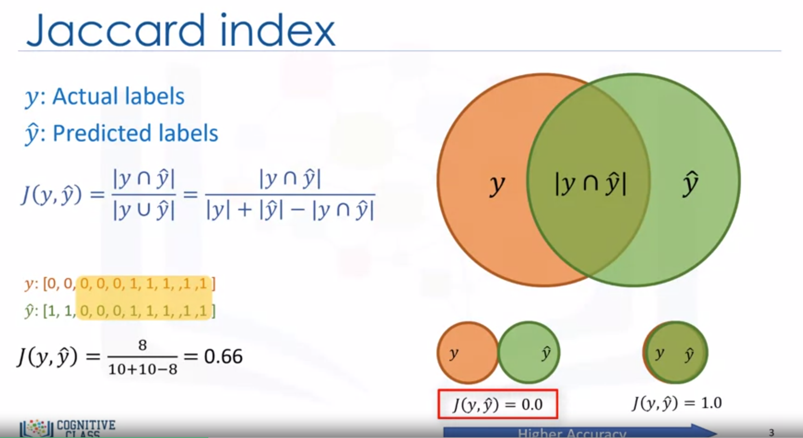
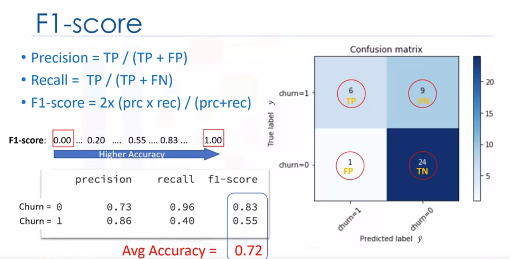
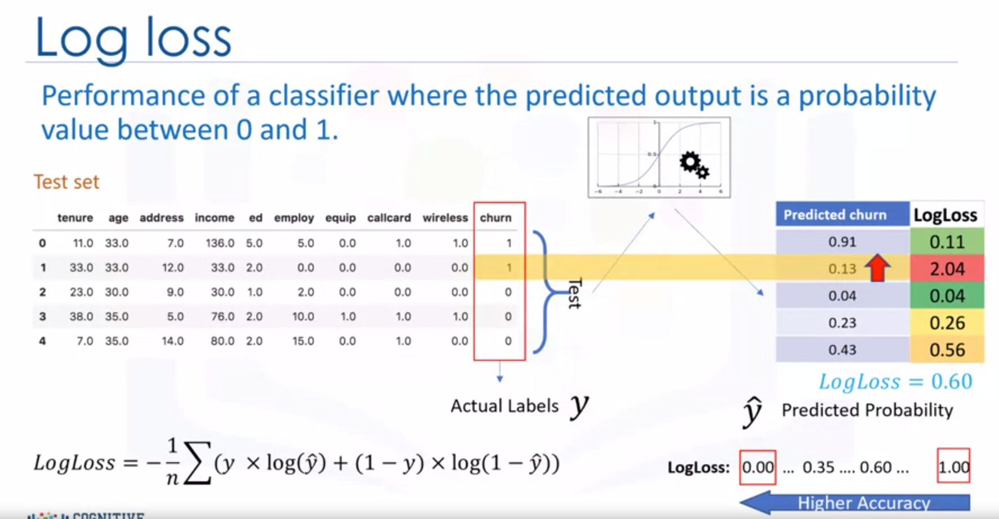

### Decision Trees

The basic intuition behind a **decision tree** is to map out all possible deicision paths in the form of a tree. **Decision trees** are built by splitting the training set into distinct nodes. One node in a Decision Tree contains all of or most of, one category of the data.

**Decision Trees** learning algorithm:
1. choose an attribute from your dataset
2. calculate the significance of attribute in splitting of data
3. split data based on the value of the best attribute
4. go to step 1

**Decision Trees** are built using recursive partitioning to classify the data. 

Which attribute is the best? **more predictiveness, less impurity, lower entropy**.  
*Impurity* of nodes is calcualted by entropy of data in the node.  
*Entropy* is a measure of randomness or uncertainty.  
The lower the entropy, the less uniform the distribution, the purer the node.  
$entropy = p(A)*log(p(A)) - p(B)*log(p(B))$.  
The attribute is determined best to make the tree with the higher **Information Gain** after splitting.  
*Information Gain* is the information that can increase the level of uncertainty after splitting.  
$informationGain = (entropyBeforeSplit) - (weightedEntropyAfterSplit)$

### Logistic Regression

**Logistic Regression** is a classification algorithm for categorical variables (for both binary classificaiton or multi-class classification). Some applications include:
* predicting the probability of a person having a heart attack
* predicting the mortality in injured patients
* predicting a customer's propensity to purchase a product or halt a subcription
* predicting the probability of failure of a given process or product
* predicting the likelihood of a homeowner defaulting on a mortage

When **logistic regression** is suitable?
* if the data is binary
* if probabilistic results are needed
* if you need a linear decision boundary
* if you need to understand the feature impact

> Linear regression cannot properly measure the probability of a case belonging to a class

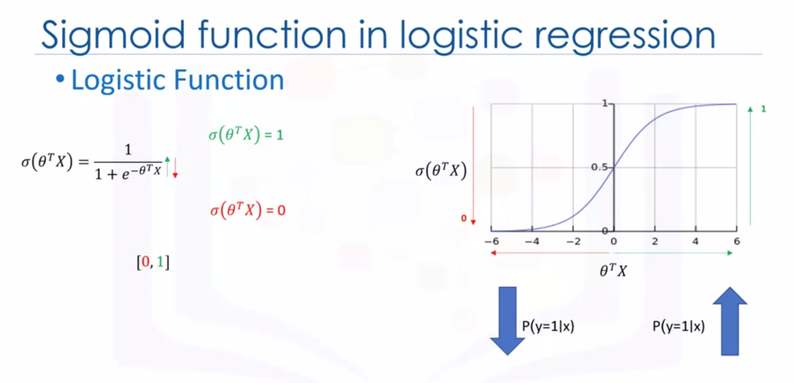

What is the output of **logistic regression** model?
* P(y=1|X)
* P(y=0|X) = 1 - P(y=1|X)

The **logistic regression** cost function:  
$cost(y', y) = -log(y')$ if $y = 1$  
$cost(y', y) = -log(1-y')$ if $y = 0$  
$J(\theta) = \frac{1}{m}\sum_{i-1}^{m} y^ilog(y'^i) + (1-y^i)log(1-y'^i)$

How to find the best parameters for the model? -- minimize the cost function  
How to minimize the cost function? -- using gradient descent  

**Gradient Descent** is a technique to use the derivate of a cost function to change the parameter values, in order to minimize the cost.

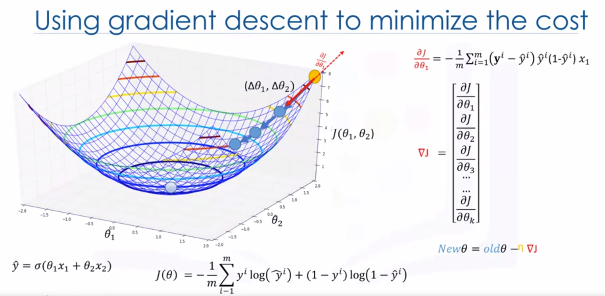

The **logistic regression** training process:
1. initialize the parameters randomly
2. feed the cost function with training set, and calculate the error
3. calculate the gradient of cost function
4. update weights with new values
5. go to step 2 until cost is small enough

### Support Vector Machine (SVM)

**Support Vector Machine (or SVM)** is a supervised algorithm that classifies cases by finding a separator.
* mapping data to a high-dimensional feature space
* finding a separator

The SVM algorithm outputs an optimal hyperplane that categorizes new examples.

**Kernelling**, such as linear, polynomial, RBF, and sigmoid, maps data into a higher dimensional space, in such a way that can change a linearly inseparable dataset into a linearly spearable dataset.

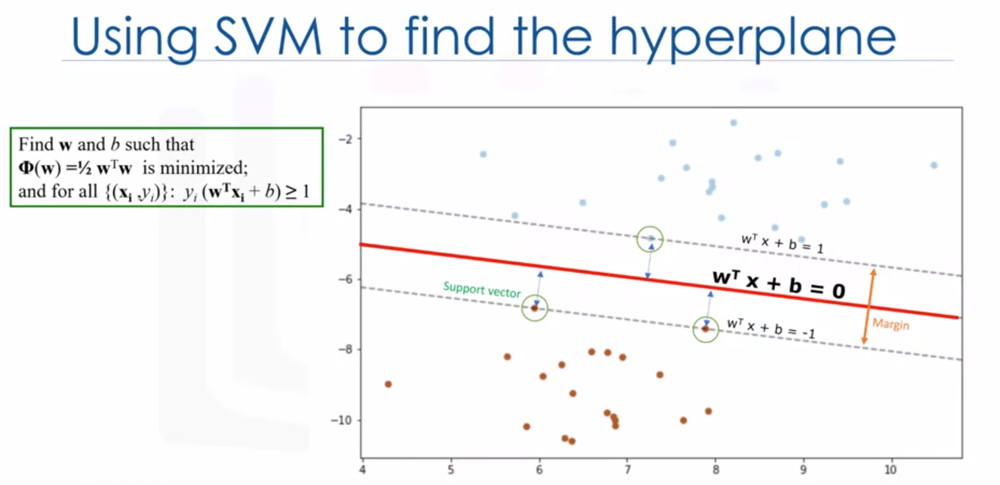

* Advantages of SVM:
  * accurate in high-dimensional spaces
  * memory efficient
* Disadvantages of SVM:
  * prone to overfitting
  * no probability estimation
  * suitable for small datasets

*Quiz*

1. Which one is NOT a sample of classification problem? -- to predict the amound of money a customer will spend in one year
2. Which of the following statements are TRUE about Logisic Regression? -- logistic regression can be used for both binary classification and multi-class classification; logistic regression is analogous to linear regression but takes a categorical / discrete target field instead of a numeric one
3. Which of the following examples are sample applications of Logistic Regression? -- the probability that a person has a heart attack within a specified time period using person's age and sex; likelihood of a homeowner defaulting on a mortgage
4. Which one is TRUE about the kNN algorithm? -- kNN algorithm can be used to estimate values for a continuous target
5. What is information gain in decision trees? -- it is the entropy of a tree before split minus weighted entropy after splity by an attribute


## Machine Learning with Python -- Week 4

**Clustering** can group data only unsupervised, based on the similarity of customers to each other. A **cluster** is a group of objects that are similar to other objects in the cluster, and dissimilar to data points in other clusters.
* *Classification* algorithms predict categorical classed labels and classification is a supervised learning where each training data instance belongs to a particular class
* In *Clustering*, the data is unlabelled and the process is unsupervised

Clustering applications include:
* retail / marketing
  * identifying buying pattern of customers
  * recommending new books or movies to new customers
* banking
  * fraud detection in credit card use
  * identifying clusters of customers
* insurance
  * fraud detection in claims analysis
  * insurance risk of customers
* publication
  * auto-categorizing news based on their content
  * recommending similar new articles
* medicine
  * characterizing patient behaviour
* biology
  * clustering genetic markers to identify family ties

Clustering can be used for one of the following purposes:
* exploratory data analysis
* summary generation
* outlier detection
* finding duplicates
* pre-processing step

### K-Means

**K-Means** can group data only unsupervised based on similarity of customers to each other. **K-Means**, as a type of partitioning clustering, divides the data into non-overlapping subsets (clusters) without any cluster-internal structure. 
* examples within a cluster are very similar
* examples across different clusters are very different

How to determine the similarity or dissimilarity? the *distance* of samples from each other is used to shape the clusters. So, **K-Means** tries minimize the intra-cluster distances and maximize the inter-cluster distances.

**K-Means** clustering algorithm:
1. randomly placing *K* centroids, one for each cluster
2. calculate the distance of each point from each centroid
3. assign each data point (object) to its closest centroid, creating a cluster
4. re-calculate the position of the *K* centroids
5. repeat the steps 2-4, until the centroids no longer move

To measure K-Means accuracy:
* external approach
  * compare the clusters with the ground truth, if available
* internal approach
  * average the distance between data points within a cluster

Increasing the number of clusters equal to reducing the distance of centroids to data points. This means increasing K will always decrease the error. The elbow point is determined where the rate of decrease sharply shifts, and this point should be the value for K for clustering.

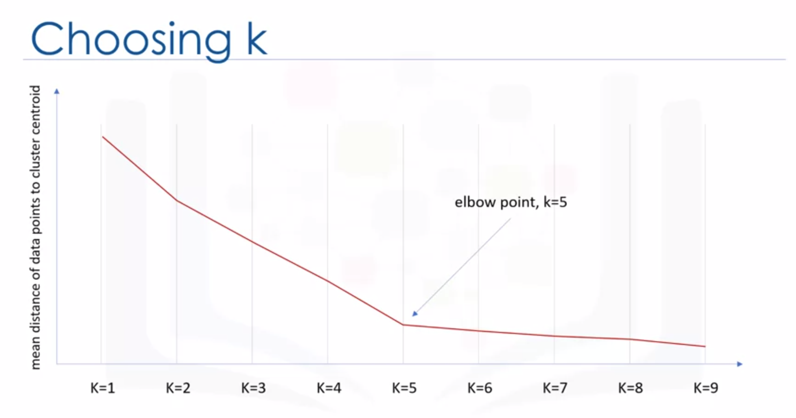

### Hierarchical Clustering

**Hierarchical Clustering** algorithms build a hierarchy of clusters where each node is a cluster consists of the clusters of its daughter nodes. Strategies for hierarchical clustering generally fall into two types, *divisive* and *agglomerative*.
* *divisive* (top-down): you start with all observations in a large cluster and break it down into smaller pieces
* *agglomerative* (bottom-up): each observation starts in its own cluster and pairs of clusters are merged together as moving up the hierarchy

Essentially, **hierarchical clustering** does not require a pre-specified number of clusters. Agglomerative algorithm is more popular than divisive algorithm.

Agglomerative algorithm:
1. create *n* clusters, one for each data point
2. compute the proximity matrix
3. repeat
   1. merge the two closest clusters
   2. update the proximity matrix
4. until only a single cluster remains

Distance between clusters
* single-linkage clustering
  * minimum distance between clusters
* complete-linkage clustering
  * maximum distance between clusters
* average linkage clustering
  * average distance between clusters
* centroid linkage clustering
  * distance between cluster centroids

Advantages of **hierarchical clustering**:
* not require number of clusters to be specified
* easy to implement
* producing a dendrogram that helps understanding the data

Disadvantages of **hierarchical clustering**:
* unable to undo any previous steps throughout the algorithm
* generally has long runtimes
* sometimes difficult to identify the number of clusters by the dendrogram

**Hierarchical Clustering** vs **K-Means**:
* hierarchical clustering
  * can be slow for large datasets
  * not require the number of clusters to run
  * gives more than one partitioning depending on the resolution
  * always generates the same clusters
* K-Means
  * much more efficient
  * requires the number of clusters to be specified
  * gives only one partitioning of the data based on the predefined number of clusters
  * potentially returns different clusters each time due to random initialization of centroids

### Density-based Clustering

The **density-based clustering** algorithm is appropriate to use thn examining spatial data, especially proper for arbitrary shape clusters.

**Density-based clustering** vs **K-Mneas**:
* Density-based clustering locates regions of high density, and separate outliers
* K-Means assigns all points to a cluster even if they do not belong in any

A specific and very popular type of density-based clustering is **DBSCAN**. **DBSCAN** is particularly effective for tasks like class identification on a spatial context.

**DBSCAN** stands for Density-Based Spatial Clustering of Applications with Noise. It is one of the most common clustering algorithms, and it works based on density of objects. It has two parameters: R and M:
* R (radius of neighbourhood)
  * radius that if includes enough number of points within, we call it a dense area
* M (min number of neighbours)
  * minimum number of data points we want in a neighbourhood to define a cluster

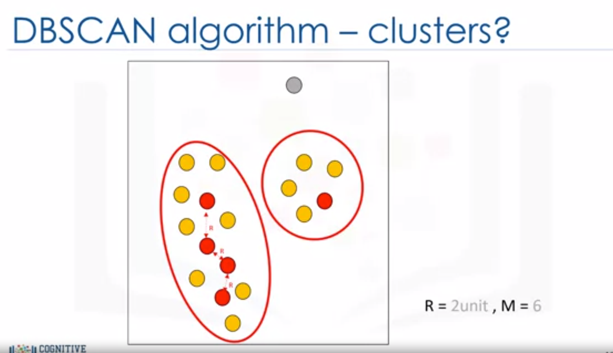

Advantage of **DBSCAN**:
* arbitrarily shaped clusters
* robust to outliers
* not require specification of the number of clusters

*Quiz*

1. Which statement is NOT TRUE about K-Means clustering? -- **as K-Means is an iterative algorithm, it guarantees that it will always converge to the global optimum**
2. Which of the following are characteristics of DBSCAN? -- **DBSCAN can find arbitrarily shaped clusters; DBSCAN has a notion of noise, and is robust to outliers; DBSCAN does not require one to specify the number of clusters such as K in K-Means**
3. Which of the following is an application of clustering? -- **customer segmentation**
4. Which approach can be used to calculate dissimilarity of objects in clustering? -- **minkowski distance; euclidian distance; cosine similarity**
5. How is a center point (centroid) picked for each cluster in K-Means? -- **we can randomly choose some observations out of the data set and use these observations as the initial means**


## Machine Learning with Python -- Week 5

Recommender systems capture the pattern of people's behaviour and use it to predict what else they might want or like. The benefits are as follows.
* broader exposure
* possibility of continual usage or purchase of products
* provides better experience

Implementing recommender systems
* memory-based
  * uses the entire user-item dataset to generate a recommendation
  * uses statistical techniques to approximate users or items
* model-based
  * develops a model of users in an attempt to learn their preferences
  * models can be created using ML techniques like regression, clustering, classification, etc

### Content-based Recommender

A content-based recommendation system tries to recommend items to users based on their profile. The user's profile revolves around that user's preferences and tastes. The recommendation process is based on the similarity between those items. Similarity or closeness of items is measured based on the similarity in the content of those items.

### Collaborative Filtering

**Collaborative Filtering** is based on the fact that relationships exist between products and people's interests. Many recommendation systems use collaborative filtering to find these relationships and to give an accurate recommendation of a product that the user might like or be interested in.

* User-based collaborative filtering
  * based on user's neighbourhood
* Item-based collaborative filtering
  * based on item's similarity

weighted_ratings_matrix = ratings_matrix_subset * similarity_matrix  
recommendation_matrix = sum_similarity_index + sum_rating_and_weight_matrix

Challenges of **Collaborative Filtering**:
* data sparsity:
  * users in general rate only a limited number of items
* cold start
  * difficulty in recommendation to new users or new items
* scalability
  * increase in number of users or items

*Quiz*

1. Which are the advantages of Recommender Systems? -- **recommender systems provide a better experience for the users by giving them a broader exposure to many different products they might be interested in; recommender systems encourage users towards continual usage or purchase of their product; recommender systems benefit the service provider by increasing potential revenue and better security for its customers**
2. What is a content-based recommendation system? -- **content-based recommendation system tries to recommend items to the users based on their profile built upon their preferences and taste**
3. What is the meaning of cold start in collaborative filtering? -- **the difficulty in recommendation when we have new user, and we cannot make a profile for him, or when we have a new item, which has not got any rating yet**
4. What is a memory-based recommender system? -- **we use the entire user-item dataset to generate a recommendation system**
5. What is the shortcoming of content-based recommender system? -- **users will only get recommendations related to their preferences in their profile, and recommender engine may never recommend any item with other characteristics**


## Applied Data Science Capstone -- Week 1

This capstone project hopefully equips you with the necessary skills to have the opportunity to be creative and come up with your own idea or problem to solve using location data. E.g. you can choose to compare different neighborhoods in terms of a service, search for potential explanation of why a neighborhood is popular, the cause of complaints in another neighborhood, or anything else related to neighborhoods. Hence the name of the capstone will be the **Battle of the Neighborhoods**.

**Location data** is data describing places and venues, such as their geographical location, their category, working hours, full address, etc, such that for a given location given in form of its geographical coordinates one is able to determine what types of venues exist within a defined radius from that location.

Features of location data providers (Foursquare / Google / Yelp):
* rate limits
* cost
* coverage
* accuracy
* update frequency


## Applied Data Science Capstone -- Week 2

Foursquare is a technology company that built a massive dataset of accurate location data. Foursquare powers location data for Apple Maps, Uber, Snapchat, Twitter, and many others. Their API and location data are currently being used by over 100,000 developers.

You communicate with the database via groups and endpoints in the form of a Uniform Resource Identifier (URI). Every time you make a call request, you have to pass your developer account credentials, which are your Client ID and Client Secret as well as what is called the verion of the API (simply a date).

Venues Data: Name / Unique ID / Category / Location

User Data: First name / Last name / Gender / ID / Contact / Friends / Tips

Using the Foursquare API, we can
* search for a specific type of venue around a given location - Regular
* learn more about a specific venue - Premium
* learn more about a specific Foursquare user - Regular
* explore a given location - Regular
* explore trending venues around a given location - Regular

*Quiz*

1. The explore endpoint is used to search for venues in the vicinity of a particular location. -- **False (the search endpoint is the appropriate endpoint to use)**
2. Which of the following parameters need to be passed every time you make a call to the Foursquare API? -- **your client secret; your client ID; the version of API**
3. Using a personal (free) developer account, you can make 500 permium calls per day. -- **True**
4. Using a personal (free) developer account, how many tips and photos can you access per venue? -- **1 tip and 1 photo**
5. Which of the following (information, call type) pairs are correct? -- **venue details, premium**


## Applied Data Science Capstone -- Week 3

Customer segmentation is the practice of partitioning a customer base into groups of individuals that have similar characteristics. One of the algorithms that can be used for customer segmentation is **K-Means** clustering.

**K-Means** is a type of partitioning clustering. It divides the data into non-overlapping subsets (clusters) without any cluster-internal structure. Examples within a cluster are very similar but examples across different clusters are very different.

